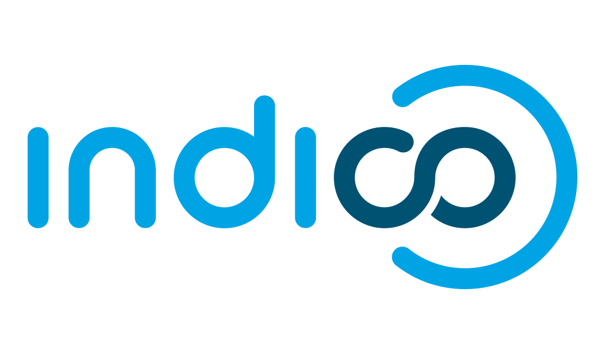
## The CERN service that everyone uses

<!-- _footer: IT-CA-CET Section Meeting - 2026-09-29 • CC BY-NC-SA 4.0 • Indico logo: © Copyright CERN -->

---

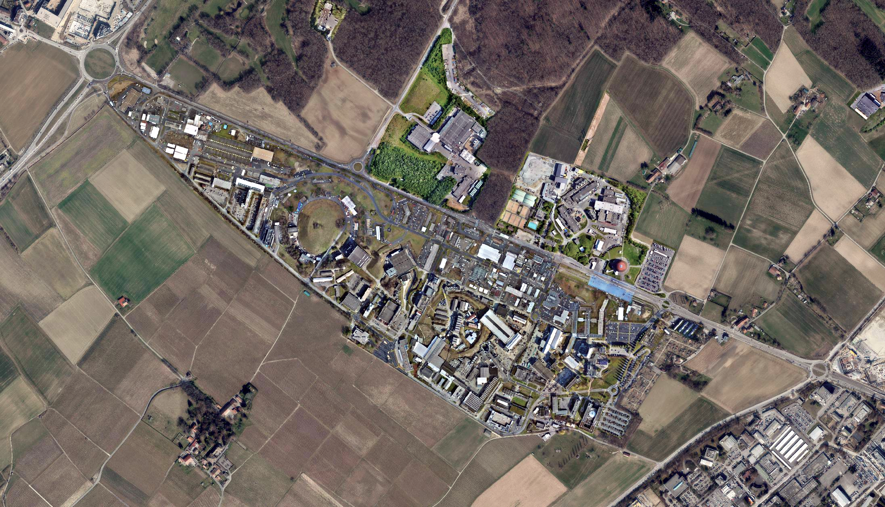

<!-- _footer: Adrian Mönnich •  IT-CA-CET Section Meeting • Sep 2026 -->

# Indico @ CERN

- **~10k** people on campus
  - spread over multiple sites
- **~225** meeting rooms
  - in **100** buildings
- **~110k** events/year
  - **~1.4M** events total
- (Distributed) meetings
- Conferences, workshops
- Lectures

---

## Adoption

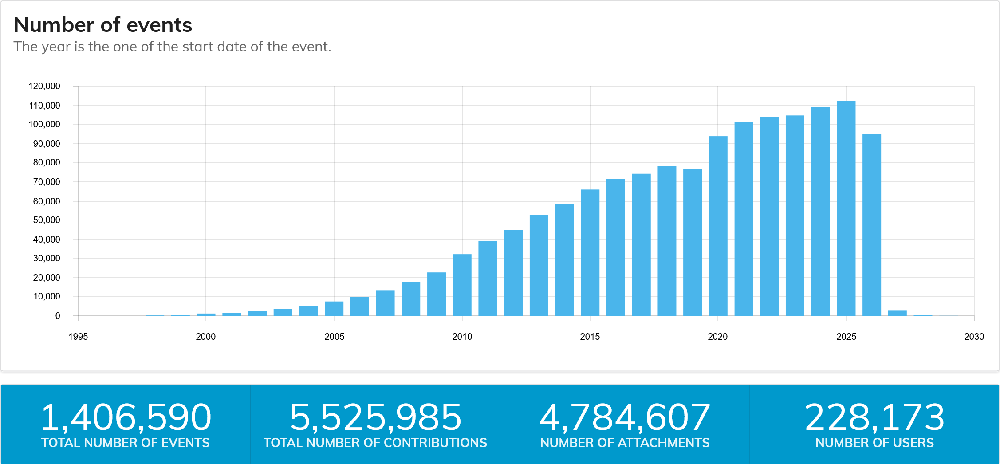

- Big boost thanks to *The Plague*
- Continuing strong even after it ended

---

## Philosophy

 - Indico itself is **CERN-agnostic**
 - CERN features through **plugins** 🧩
 - Custom **themes** & templates 🎨

---

## Integrations

- Video conferencing (Zoom) 📹
  - Zoom Rooms integration
- Webcast/recording service 📡 🎥
- Conference room assistance 🆘
- CERN visitor badges 👮‍♂️
- Room/desk/lab booking 🏢 🪑🔬
- Event payment (PostFinance) 💰
- Automatic conversion to PDF 🖨
- Search (Citadel) 🔎
- Storage (S3) 💾
- URL shortening 🔗
- Prometheus metrics 📊📉

---

### Custom meeting themes

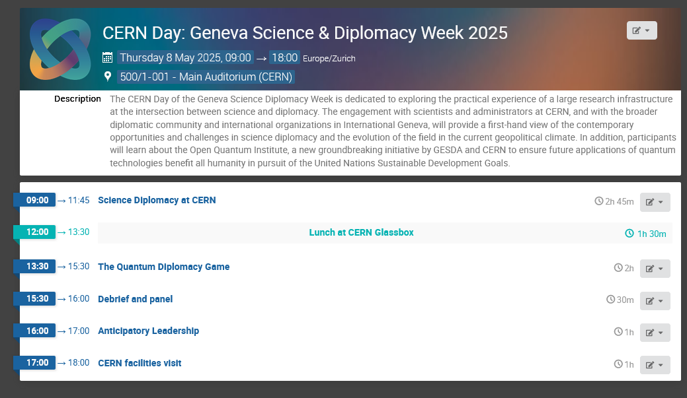

---

### Hotdesking

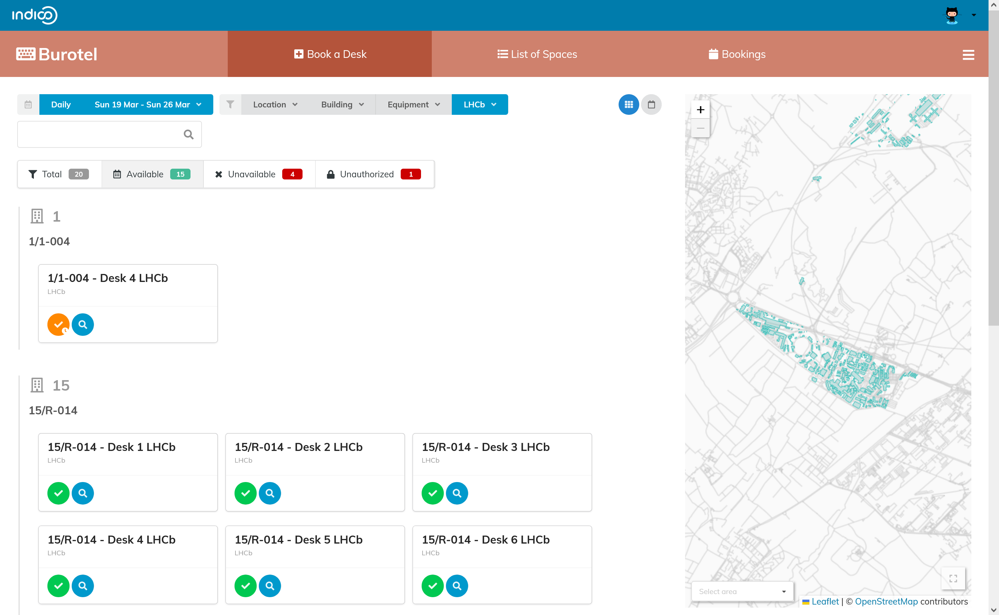

- Separate "Burotel" instance
- Customized Room Booking module via plugin
- Integration with Access Control system to grant access to offices

---

### Hotlabbing (or whatever you want to call it)

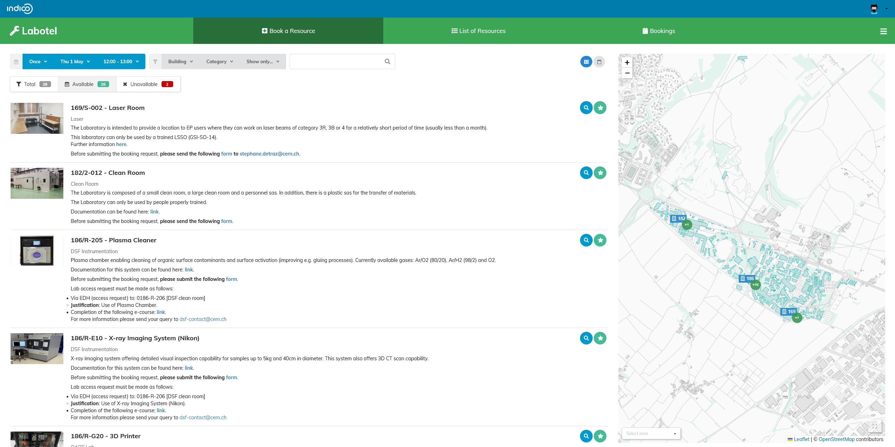

- Separate "Labotel" instance
- Customized Room Booking module via plugin
  - copy of Burotel plugin, with unnecessary functionality removed

---

#### Hot... showering? 🚿

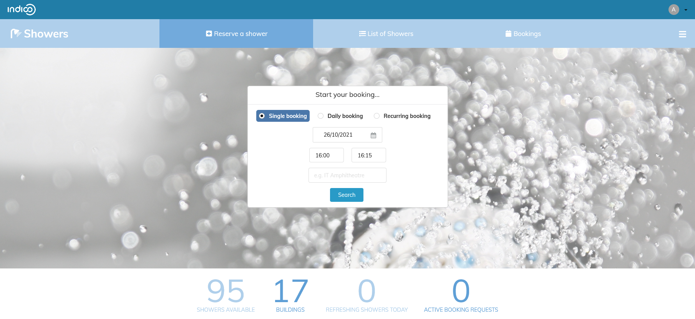

- Similar to Burotel
- 750 users signed up within a day!
- First test of new Room Booking module
* April fools 2019 🐟

---

### Best of shower ~~thougths~~ bookings 🚿 🏆

- This is SOOOO great ! With the recurring booking feature, I’ll never forget a monthly shower anymore !
- IR-ECO-CO team building event including foam party etc.
- Test of my new dinghy boat. Catastrophic flooding expected.
- Not allowed to wash walrus in office.
- Hadronic shower collaboration meeting. Bubble chamber section after coffee break. Vidyo not available, bring your own soap
- Rubber duck collaboration meeting 🦆🦆🦆
- Need to test my new armrests in a safe environment
- I'll be using it with a friend <small>(We're pretty sure this would break a few CERN rules)</small>

<!-- _footer: Source: https://indico.cern.ch/news/40-cern-showers & https://indico.cern.ch/news/41-april-fools-day -->

---

## Extended user documentation

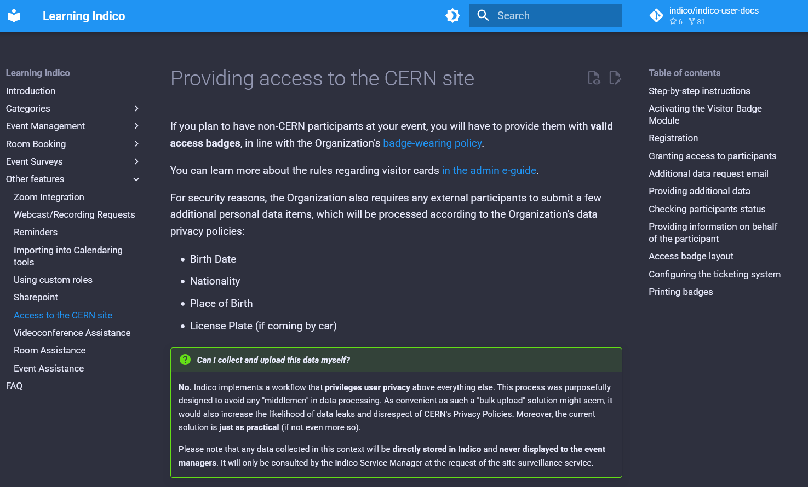

https://indico.docs.cern.ch <small>also linked from the Indico footer</small>

---

## Fully Open Source

- Useful examples for more complex plugins
- API credentials are of course not public
- CERN people contribute 

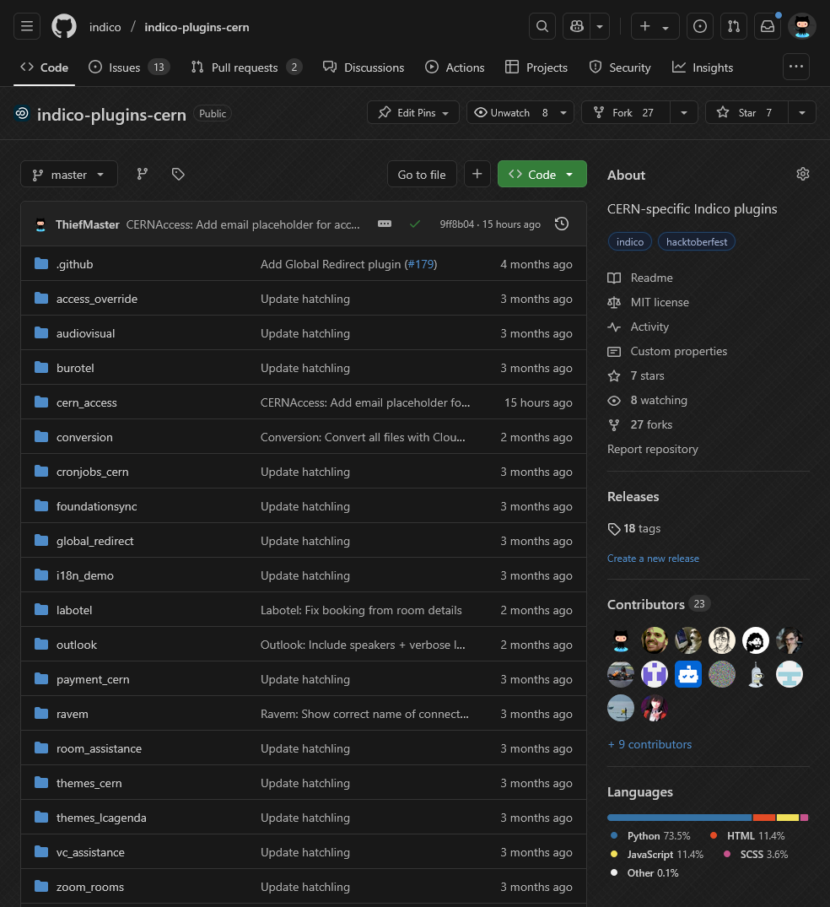

---

## Bleeding-edge

- We build our wheels (using GitHub actions) from `master`
  - or occasionally from a branch like `3.3.x`
- `indico.cern.ch` has the latest and newest features
  - we can quickly react to and fix bugs/errors there
  - all "public releases" battle-tested on `indico.cern.ch`

---

## Infrastructure

- DNS round-robin for indico.cern.ch
- 2 haproxy loadbalancers (2 cores, 8 GB)
- 4 web workers (8 cores, 32 GB)
  - 48 uWSGI processes each
- 1 celery worker (likewise)
- 1 redis cache (1 core, 4 GB)
- 1 Postgres database (IT-managed, 69 GB used 😏)
- S3 storage (Ceph-based, 30 TB used)

---

### Monitoring with Sentry

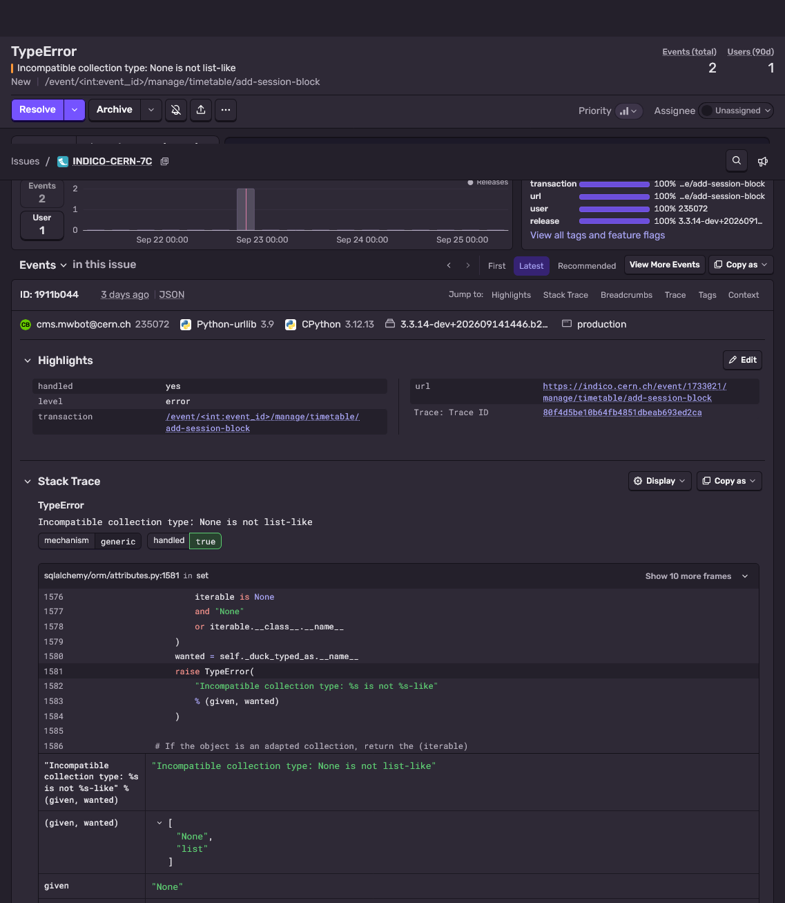

- No annoying error emails!
- Using Cloud Sentry (way more convenient than self-hosting)
- More insight than just error message and traceback:

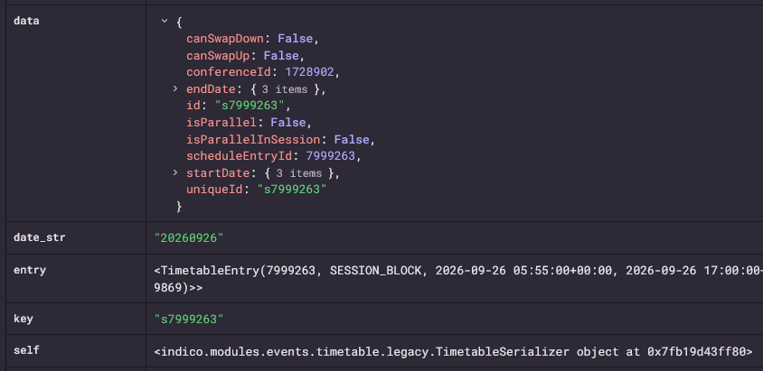

---

### Prometheus metrics - servers + performance

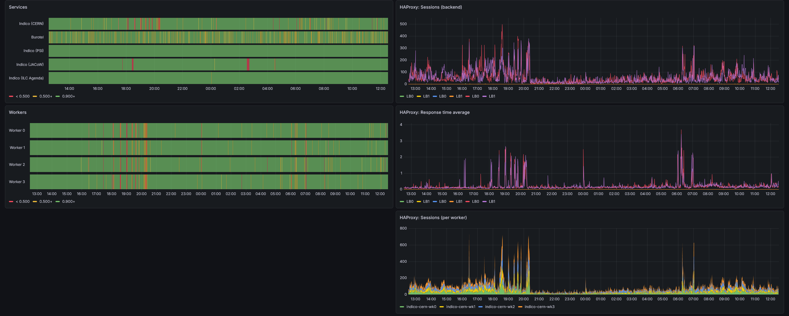

---

### Prometheus metrics - events + users

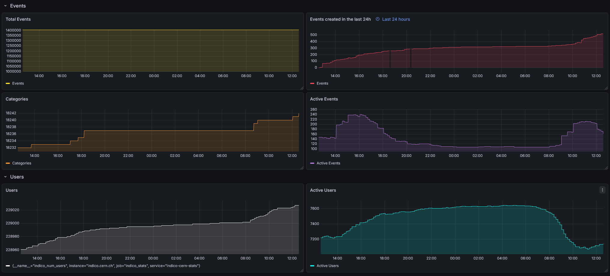

---

### Prometheus metrics - files + search

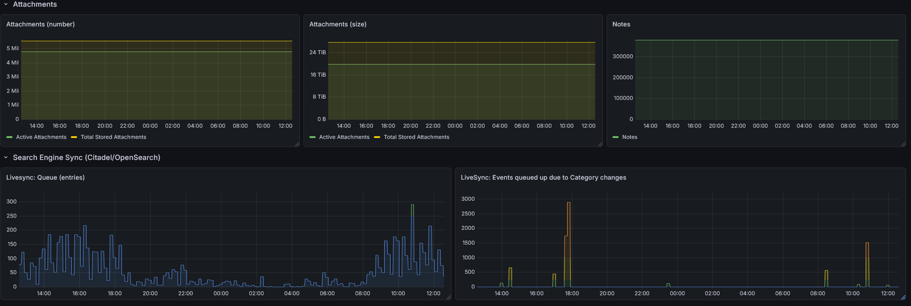

---
### Anubis... crawlers everywhere 🕷🤖

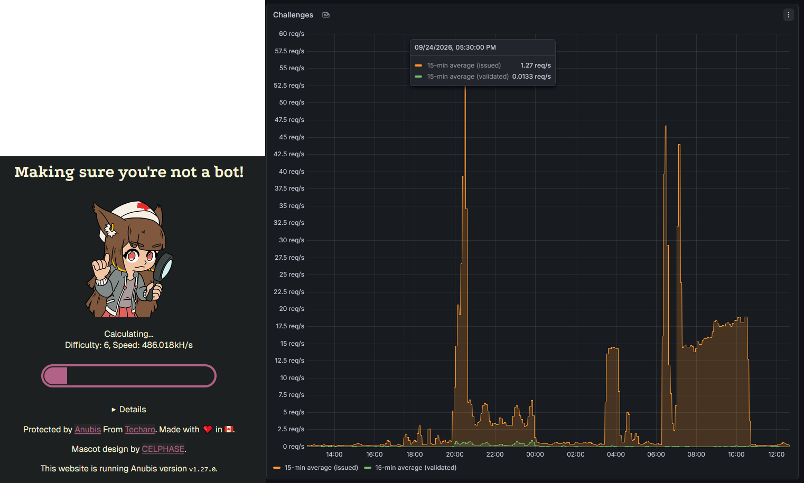 

---

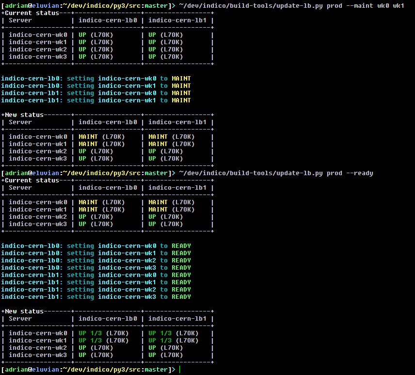

### Zero-downtime upgrades

- Take two workers out of haproxy
- Update + restart them
- Bring them back up
- Take the rest out
- Update + restart those
- Bring them back

---

### Did this last slide look familiar?

* **It is exactly the same as 2 years ago and 4 years ago**
  <small>(if you attended an Indico workshop)</small>
* It still works perfectly (for about 10 years now)

* **Simple infrastructure and tooling** which can be debugged easily
  * No k8s, Openshift, AI, orchestration or other magic going on!
  * Something breaks? `ssh` and `vim` to the rescue. No waiting.

---

### Backups

- **Postgres**
  - Daily backups done by DBoD service
  - `pg_dump` to EOS every 6h 
- **S3**
  - `rclone` sync to backup S3 host every 15min
  - Also syncing to EOS every night
  - ...because we REALLY wouldn't want to lose people's slides etc.

**So far we never needed to roll back to our backups BTW! :)**
But they are very useful when ✨ users do user things ✨  🐒

---

## Support

- Yeah we all love this
- Weekly rotas within the team
  - "everyone keeps an eye on support" in case of absences
- Indico.Global category requests huge source of "annoying" tickets
  <small>(very repetitive, never interesting/fun to handle)</small>
  2nd line now handles those 🦥

---

<!-- _backgroundColor: #021e2b -->

