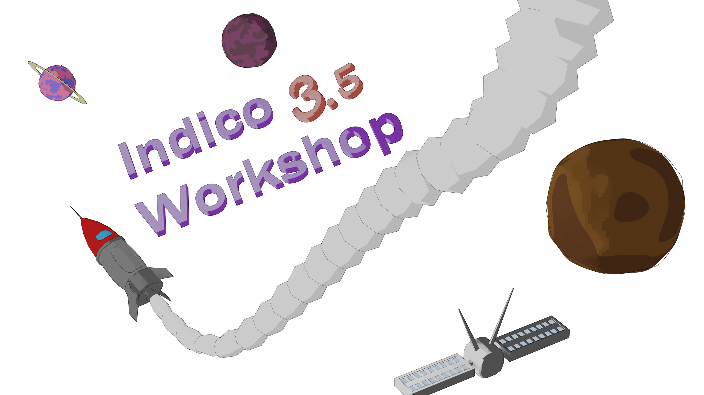
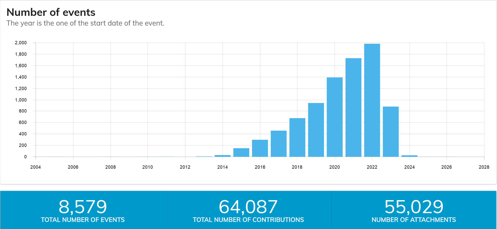

<!-- _backgroundColor: #449288 -->

---

<!-- _footer: Adrian Mönnich • Indico Workshop 3.5 • March 2023 -->

# Indico @ CERN

- **~10k** people on campus
  - spread over multiple sites
- **~220** meeting rooms
- **~100k** events/year
  - **>1M** events total
- (Distributed) meetings
- Conferences, workshops
- Lectures

---

## Adoption

- Strong growth, big boost thanks to *The Plague*

---

## Philosophy

 - Indico itself is **CERN-agnostic**
 - CERN features through **plugins** 🧩
 - Custom **themes** & templates 🎨

---

## Integrations

- Video conferencing (Zoom) 📹
- Webcast/recording service 📡 🎥
- Conference room assistance 🆘
- CERN visitor badges 👮‍♂️
- Room/desk booking 🏢 🪑
- Event payment (PostFinance) 💰
- Automatic conversion to PDF 🖨
- Search (Citadel) 🔎
- Storage (S3) 💾
- URL shortening 🔗

---

### Custom meeting themes

---

### Hotdesking

- Separate "Burotel" instance
- Customized Room Booking module via plugin

---

#### Hot... showering? 🚿

- Similar to Burotel
- 750 users signed up within a day!
- First test of new Room Booking module
* April fools 2019 🐟

---

### Best of shower ~~thougths~~ bookings 🚿 🏆

- This is SOOOO great ! With the recurring booking feature, I’ll never forget a monthly shower anymore !
- IR-ECO-CO team building event including foam party etc.
- Test of my new dinghy boat. Catastrophic flooding expected.
- Not allowed to wash walrus in office.
- Hadronic shower collaboration meeting. Bubble chamber section after coffee break. Vidyo not available, bring your own soap
- Rubber duck collaboration meeting 🦆🦆🦆
- Need to test my new armrests in a safe environment
- I'll be using it with a friend <small>(We're pretty sure this would break a few CERN rules)</small>

<!-- _footer: Source: https://indico.cern.ch/news/40-cern-showers & https://indico.cern.ch/news/41-april-fools-day -->

---

## Extended user documentation

---

## Fully Open Source

- Useful examples for more complex plugins
- API credentials are of course not public - so no self-made visitor passes for you ;)

---

## Global Indico

- Subcategory on indico.cern.ch
- "Fair use" policy
- No CERN Zoom service
- Best-effort support
- Soft quotas (per community)
  - max. 50 events / year
  - max. 200 participants / event

---

---

## Infrastructure

- DNS round-robin for indico.cern.ch
- 2 haproxy loadbalancers (4 cores, 8 GB)
- 4 web workers (16 cores, 32 GB)
- 1 celery worker (likewise)
- 1 redis cache (2 cores, 4 GB)
- 1 Postgres database (IT-managed, ~45GB used)
- S3 storage (Ceph-based, ~17 TB used)

---

### Monitoring with Sentry

- No annoying error emails!
- Self-hosted (FOSS), but Cloud is also possible
- Much more insight than just error and traceback:

---

### Zero-downtime upgrades

- Take two workers out of haproxy
- Update + restart them
- Bring them back up
- Take the rest out
- Update + restart those
- Bring them back

---

### Backups

- **Postgres**
  - Daily backups done by IT DB service
  - `pg_dump` to EOS every 6h 
- **S3**
  - `rclone` sync to backup S3 host every 15min
  - Also syncing to EOS every night
  - ...because we REALLY wouldn't want to lose people's slides etc

**So far we never needed to roll back to out backups BTW! :)**

---

<!-- _backgroundColor: #021e2b -->

