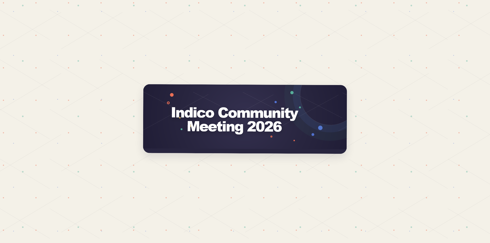
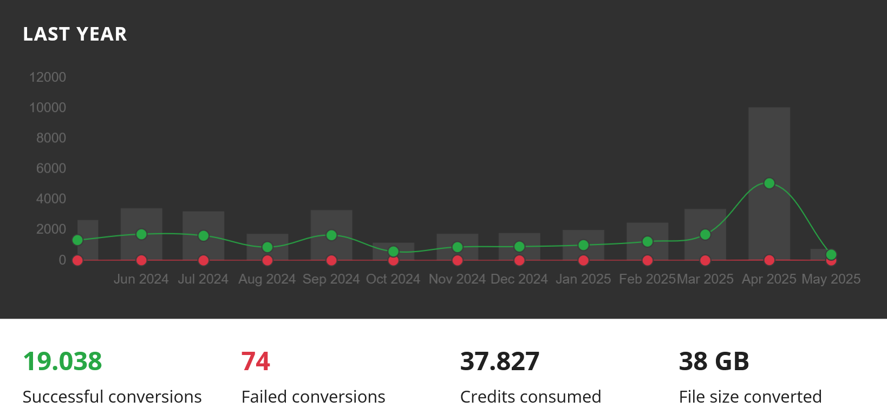

<!-- _backgroundColor: #161630 -->

---

<!-- _footer: '
  Adrian Mönnich • Indico Workshop 2025 • May 2025 
  Picture: Adobe Firefly
' -->

# PDF Conversion: CloudConvert

---

## Why convert at all?

- Users upload all kinds of presentation materials
  - pptx, docx, ppt, ....
  - OK for editing, not for archival
  - Useless without additional software installed
- PDF files are (hopefully) eternal
  - all modern browsers can display them natively
  - (somewhat) less complex format

---

## The old system <small>"Doconverter"</small>

- Custom infrastructure around commercial tool (Neevia)
- Not managed by the Indico team (same section though)
- Gets stuck sometimes, may require manual intervention
- High maintenance burden (Windows VMs!)
- also used for engineering files
  - unrelated to Indico
  - other CERN department

---

## Looking for alternatives

<small>Data from late 2021, may be different now</small>

| Feature       | CloudConvert | Adobe DC                 | PSPDFKit                 | cloudmersive                        | ConvertAPI                     | Convertio                         |
|:------------- | ------------ | ------------------------ | ------------------------ | ----------------------------------- |:------------------------------ | --------------------------------- |
| Monthly price | €73.00       | $500                     | $574.60                  | $19.99                              | CHF284.34                      | $86.00                            |
| Max file size | "5 hours"    | 100MB                    | Not specified            | 1GB                                 | 2GB                            | Unlimited                         |
| Formats       | ✅           | ❌missing odt, odp, html | ❌missing odt, odp, html | ❌missing odt, odp                  | ✅                             | ✅                                |
| Usable API    | ✅           | ✅                       | ✅                       | ✅                                  | ✅                             | ✅                                |
| Webhooks      | ✅           | ❌                       | ❌                       | ❌                                  | ✅                             | ❌                                |
| EU servers    | ✅           | ❌                       | ✅                       | ❌                                  | ✅                             | ✅                                |
| Results OK    | ✅           | ✅                       | ❌Changes many fonts     | Not tested (can be done with trial) | ❌ Missing pages, HTML is tiny | ✅  (HTML to PDF has bad margins) |

---

### Clear winner: CloudConvert

- Very good pricing
  - monthly subscription or prepaid (non-expiring) credits
- Clean and easy to use API
- Hosted in Germany :de:
- Excellent privacy/security policy
- https://cloudconvert.com

---

---

### Fun with Procurement

- CloudConvert uses self-service payment via credit card 💳
  - CERN likes to pay via invoice and bank transfer
  - Companies like to charge "enterprise prices" for that :money_with_wings:
- We managed to sort it out in the end :)
  - Ready to go for a "trial run" with a paid account

---

### Why a trial run?

- CERN privacy / data protection regulations ⚖
  - Can't just send restricted CERN data to a public cloud ⛔
- But... Indico has tons of public files
  - anyone can access those anyway, so no such restrictions!

---

- Not a single ticket/complaint
- Completely transparent

---

---

## Going all in (2024)

- CERN security + privacy reviews successful
- *Fun with Procurement 2.0* - but all solved in the end
- Credits for ~1 year worth of conversions bought (around 1000€)

---

### Some development needed

- Disclaimer about cloud-based conversion (transparency!)
- Generic filenames (`attachment.pptx` instead of `firing-dom.pptx`)
- Use CloudConvert for all files (not just public ones)

---

### We have lift-off 🚀 (March 2025)

---

## But it's still in `indico-plugins-cern`...

- Used to be CERN-specific (Doconverter)
- Code related to it still in the plugin
- Based on a very generic Indico plugin hook
  - just adds a form field to a particular form
  - no fancier features possible

---

### Make it public and fancy?

- Create the concept of "converted materials" in the core
  - link to "source" file
  - possibly cascade deletes
  - group in the UI?
- New plugin would be simply a "CloudConvert" plugin
- Other conversion providers/tools could have their own plugin
- Not sure when we'll have the time for that...

---

### What if I want it now?

- Build it yourself from Git
- Download a wheel from our CI builds
- As always, this is unsupported :)
  - but it's safe, you'd be running the same code we run

---

<!-- _backgroundColor: #021e2b -->

