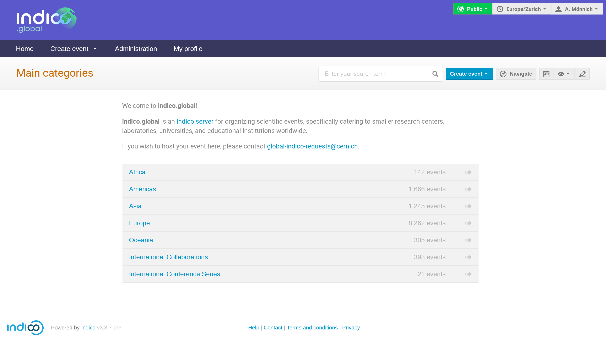
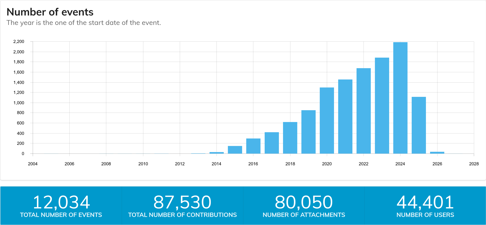

<!-- _backgroundColor: #161630 -->


---

<style scoped>
  section {
    display: flex;

    p:nth-child(2) {
      align-self: center;
      margin-bottom: 0;
    }

    p:nth-child(3) {
      align-self: flex-end;
    }
  }
</style>

The death of the Global Indico category...


...and its resurrection as
~~a zombie~~ [Indico.Global](https://indico.global)


<!-- _footer: '
  Adrian Mönnich • Indico Workshop 2025 • May 2025<br>
  Picture: Adobe Firefly 🤖
' -->

---



---



- Events from the former *Global Indico* category
- Category structure grouped by continents

---

## Fair use policy

- Like before, purely a **soft limit** stated in the ToS.
  - People need to agree when requesting a category
- Not actively enforced, and no plans to change this (for now)
  - But it gives us something to use in case of excessive/abusive use

---

## No automation?!

- Category requests are done via an email to us (opens a ticket)
- We don't want this to be a "real SaaS"
  - The recommended way of using Indico is to self-host it!
- Allows for some sanity checks (who's requesting it etc.)

---


<!-- _footer: Picture: Adobe Firefly -->

---

## How did we do it - the gory details

- Indico has a low-level event import/export feature
  - `indico event export` on the CLI
  - exports a **single** event
- Kind of like an SQL DB dump with selected data and relationships
- IDs are replaced with UUIDs and resolved during import
- Materials etc. also included in the archive

---

```yaml
affiliations: {}
db_version:
- 4615aff776e0
dummy_files: false
export_version: 2
external_storage_backends: []
indico_version: 3.3.7-dev
object_files:
- objects-1.yaml
timestamp: 2025-05-01 13:12:02.385407+00:00
users:
  5cb4e90e-cf20-454f-b6ad-4e9a09745aa4:
    address: ''
    affiliation: CERN
    affiliation_id: null
    all_emails:
    - adrian.moennich@cern.ch
    email: adrian.moennich@cern.ch
    first_name: Adrian
    identities: []
    is_deleted: false
    last_name: "M\xF6nnich"
    merged_into_id: null
    phone: '+41227663666'
    title: !!python/object/apply:indico.modules.users.models.users.UserTitle
    - 0
```

---

```yaml
!!python/tuple
- !!python/tuple
  - events.events
  - !!python/tuple
    - true
    - 7f266756-cb63-47bf-a383-69695fed5efd
  - access_key: ''
    created_dt: !!python/tuple
    - datetime
    - '2025-05-01T13:11:38.582058+00:00'
    creator_id: !!python/tuple
    - userref
    - 5cb4e90e-cf20-454f-b6ad-4e9a09745aa4
    end_dt: !!python/tuple
    - datetime
    - '2025-05-01T16:00:00+00:00'
    id: !!python/tuple
    - idref_set
    - 7f266756-cb63-47bf-a383-69695fed5efd
    is_locked: false
    keywords: []
    last_friendly_contribution_id: 0
    protection_mode: !!python/object/apply:indico.core.db.sqlalchemy.protection.ProtectionMode
    - 1
    start_dt: !!python/tuple
    - datetime
    - '2025-05-01T14:00:00+00:00'
    subcontrib_speakers_can_submit: true
    timezone: Europe/Zurich
    title: Simple export test
    type: !!python/object/apply:indico.modules.events.models.events.EventType
    - 1
    venue_name: ''
    visibility: null
- !!python/tuple
  - events.persons
  - !!python/tuple
    - false
    - 7f266756-cb63-47bf-a383-69695fed5efd
  - affiliation: CERN
    email: adrian.moennich@cern.ch
    event_id: !!python/tuple
    - idref
    - 7f266756-cb63-47bf-a383-69695fed5efd
    first_name: Adrian
    id: !!python/tuple
    - idref_set
    - 453a3946-adee-4ca6-af2d-fffccb678e0b
    last_name: "M\xF6nnich"
    phone: '+41227663666'
    title: !!python/object/apply:indico.modules.users.models.users.UserTitle
    - 0
    user_id: !!python/tuple
    - userref
    - 5cb4e90e-cf20-454f-b6ad-4e9a09745aa4
```

---

### The problems...

- This does not scale: 10k events to migrate, 1 TB of materials
- Categories have settings, materials, etc. as well
- Database IDs change, original IDs not part of the export archive
- Indico also uses UUIDs e.g. for registration tokens
- **We do not break links, period.**
  - Redirects needed from the old URLs to the new ones
    

---

### ...and their solutions

- Allow exporting **whole category subtrees**
- ID-to-UUID mapping in the archive
- Option to **preserve original UUIDs** (registrations etc.)
- Option to store file paths instead of file content
  - **Copy files directly** between storage backends (S3 buckets)
- Option to generate old-to-new ID mapping during import
  - Custom plugin (on indico.cern.ch) to redirect using this mapping

---

<style scoped>
  section {
    padding-left: 20px;
  }
</style>


### It was SLOW

- Over 1h just to load the archive
- YAML is great to read, but slow
- Used Pickle 🥒 instead
- Less than <1min to load 🚀


<!-- _footer: Picture: ["White and Brown Shell Snail on Green Leaf"](https://www.pexels.com/photo/white-and-brown-shell-snail-on-green-leaf-53203/) (CC0) -->

---

### Testing a lot saved our ass

- The original export script missed some data
  - Track reviewer/convener assignments
  - PDF document templates and files
  - Event labels ("postponed" etc.)
    - tricky: instance-level data not part of exports
    - solution: map by title (if label exists on the target instance)
- Recovering this after the migration would have been a HUGE pain

---

### (Semi-)manual checks needed

- `indico.cern.ch` is (sometimes too) easy to use for CERN people
- Categories related to LHC Experiments inside Global Indico
  - usually specific to a particular institute
  - but those are clearly CERN-related nonetheless
  - Experiments have categories for national/institute meetings
- How to spot those?
  - ACLs containing CERN "egroups" (basically LDAP groups)
  - Events using Zoom (only available to CERN account holders)
  - Semi-automated email notifications for both

---

<style scoped>
  h2 > small {
    font-size: 0.7em;
  }
</style>

## Migration day... <small>or how I spent my Sunday night</small>

These are the notes I took during the migration.
Completely raw and unedited!

```
22:40 - starting (install latest master in prod, run scripts to fix crap, etc.)
23:05 - export starting
01:10 - export finished
01:20 - starting import
01:45 - starting import again on local machine (previous one went OOM on prod VM)
02:10 - restarted import (realized that event labels were missing and would have been lost)
03:00 - main import done
03:25 - automated cleanups (linking users etc) done
03:35 - db commit done
03:40 - imported id mapping on prod
03:45 - restoring dump from local db to dbod
04:00 - finished various manual cleanups
04:05 - starting s3 file copying and going to bed
04:15 - fixing script to flag the old events/categories as deleted
04:30 - really going to bed now ;)
11:55 - s3 file copying finished
```

---

### (Almost) everything went well

- 💚 No indico.cern.ch downtime at all
  - we would not want that even on a Sunday night
  - read-only mode for Global Indico category (via custom plugin)
- 💚 All events + categories migrated
- 🟡 Just a few categories/events that should have stayed behind
- 😡 Events embedding images using relative URLs (using the old IDs)
- 😡 ID mapping for event images missing
- 😡 Image file IDs in badge templates (JSON data) not updated

---

### Fixing the 🟡😡 parts

- Added new commands to the plugin to "de-migrate" events/cats
  - undeletes + removes the redirect ID mapping
  - moves them to a new parent category
- Small scripts to fix the missing/bad data
  - These bugs should eventually be fixed in the import/export util

---

<!-- _backgroundColor: #021e2b -->


