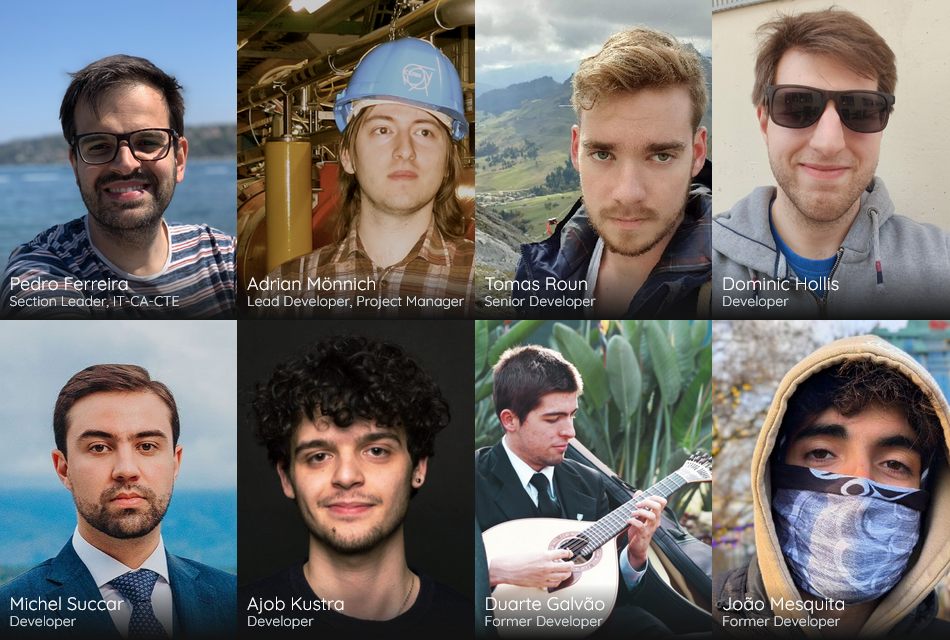
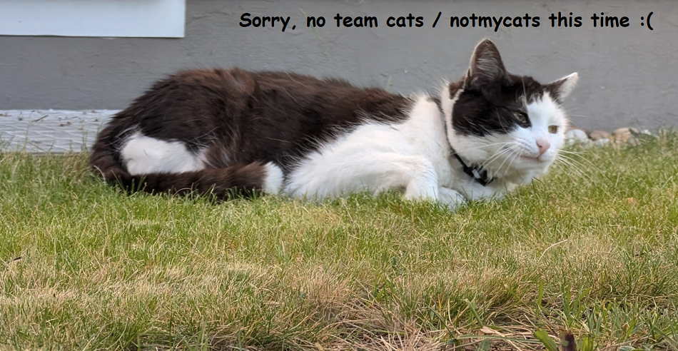
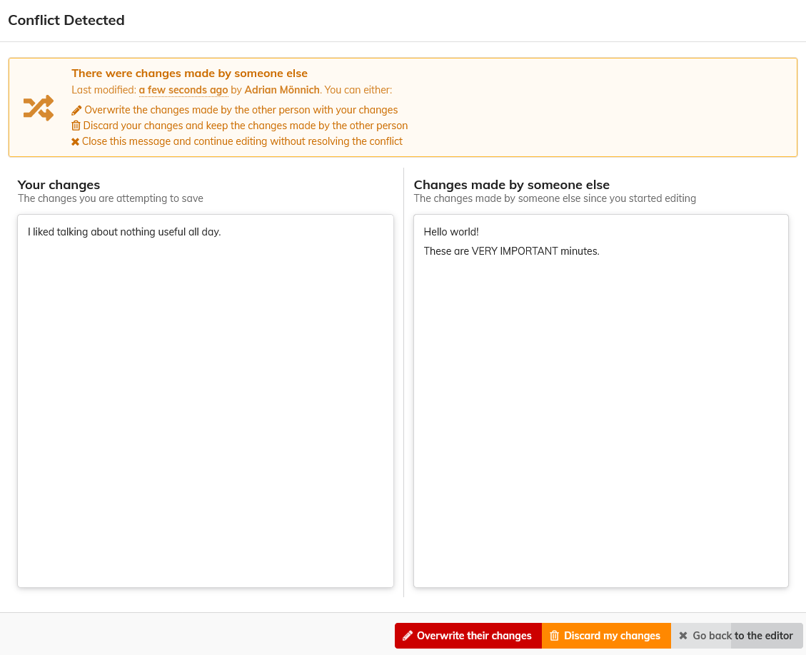
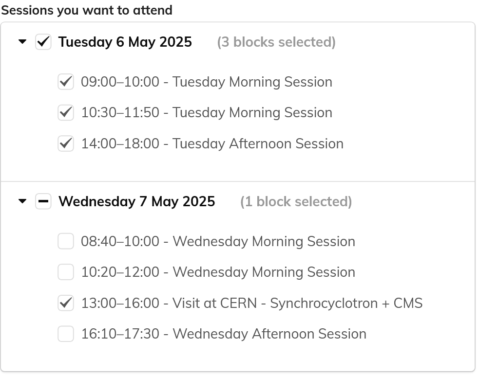
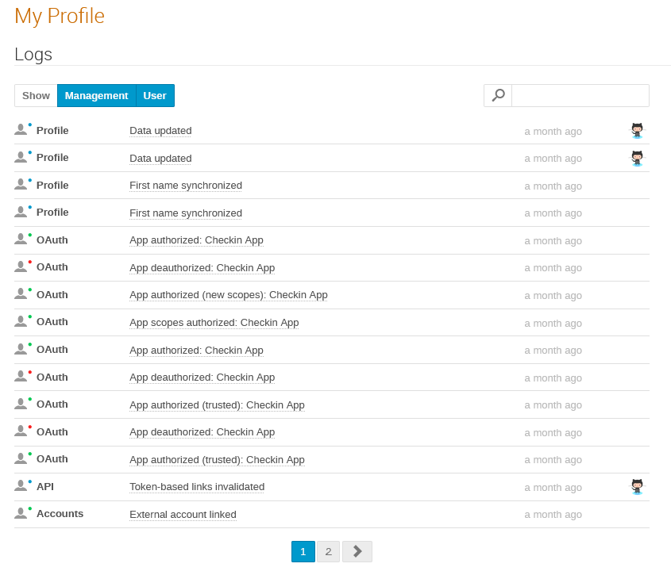
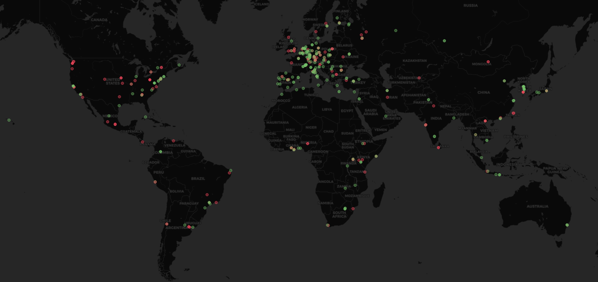
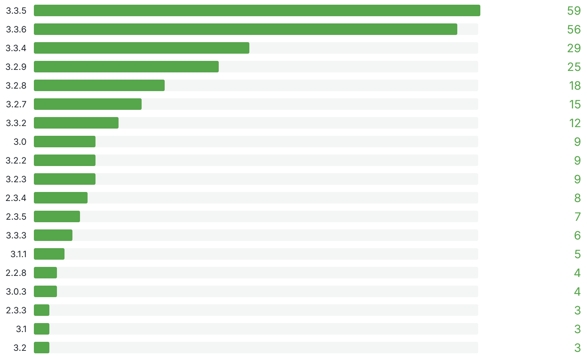
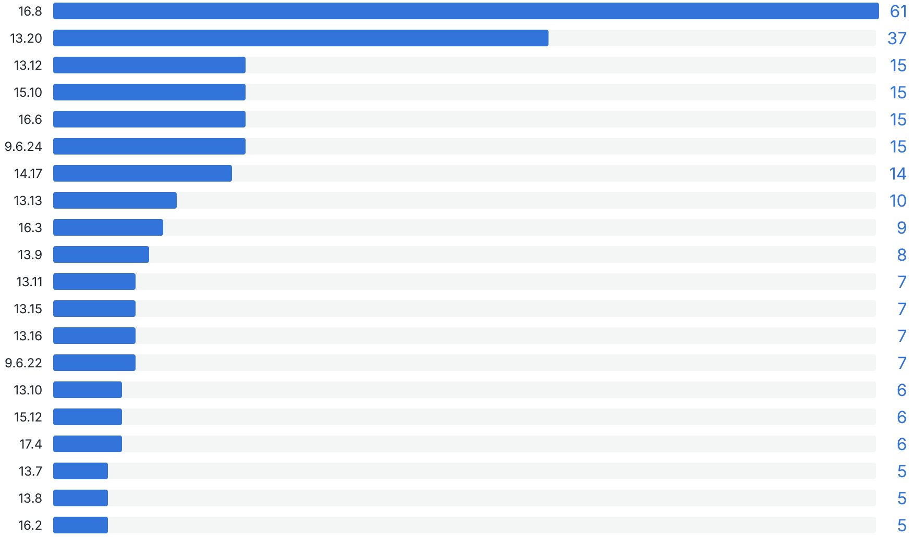
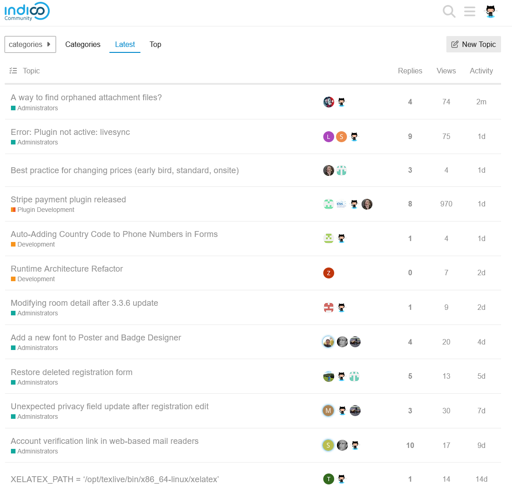

<!-- _backgroundColor: #161630 -->

---

<!-- _footer: '
  Adrian Mönnich • Indico Workshop 2025 • May 2025 
  Picture: ["Pillars of Creation" by NASA](https://www.flickr.com/photos/nasawebbtelescope/53876176351/) (CC BY)
' -->

# What's new in the Indicoverse
## v2.0.2.5

---

## Thanks for all your contributions

Many old faces, but also some new.
Couldn't have worked with - and still work with - better people! 💙

<!-- _footer: Only listing people who've been with us since the last Workshop in 2023 -->

---

## Releases

- **1** big release [v3.**3**]
  - Python version bump
  - Drop support for ancient OS (CentOS 7, old Debian/Ubuntu)
  - Large amount of "major" features
- **12** "smaller" releases [v3.3.**6**]
  - Features
  - Bugfixes
  - Security improvements

<!-- _footer: Yes, our version numbering is still pretty chaotic. We're basically doing rolling releases. -->

---

### v3.3 **(March 2024)**

Pretty much a major release!
<small>Any feature with 🌟 has a dedicated presentation during this workshop!</small>

- PDF document templates (receipts, certificates, etc.) 🌟
- Weekday-based recurrence of room bookings
- Custom registration form fields in badge/ticket templates
- New Check-in app 🌟
- Badges/tickets for accompanying persons
- Google Wallet / Apple passbook integration for tickets (UNOG) 🌟
- Many accessibility improvements (UNOG)
- More powerful event/room booking linking (Unconventional)

---

### v3.3.2 **(April 2024)**

- Conflict warning for concurrent edits to minutes
  

---

### v3.3.3 **(June 2024)**

- Timetable sessions field for registration form (UNOG)
  
- Link existing room booking occurrences to an event (Unconventional)

---

### v3.3.4 **(September 2024)**

- Weekday-specific (un-)available hours for rooms
- Quick notification template setup in Call for Abstracts (UNOG)

---

### v3.3.5 **(December 2024)**

- Stop spoofing email senders
  - rewrite `From` address to generic sender instead
  - real sender in `Reply-to` and human-friendly part of `From`

---

### v3.3.6 **(March 2025)**

- Completely new PDF timetable generation 🌟
- Allow password reset if user has no local account yet
- Allow disabling usernames in favor of email address during login
- Much more flexible event import/export 🌟
- New and more accessible date picker widget
- Location-based ACLs in room booking module (UNOG)
- Add log for user actions (UNOG)

---

---

### There's much more

This was just a tiny selection of features!
Consult the changelog for a full list:

https://docs.getindico.io/en/stable/changelog/

---

## Under the hood

- **GitHub Actions** CI to build and release Indico
  - likewise for plugins
  - no more building releases on my dev machine :)
- **pyproject.toml** metadata + hatchling for Python builds
  - modern tooling, all declarative
- **uv** for blazingly fast installs
  - not part of our official docs (yet?)
  - works as drop-in replacement instead of `pip`
- **ruff** for linting
  - one of the best newcomers in the Python ecosystems
- **TypeScript**
  - slowly starting to use it in new code

---

<!-- _backgroundColor: #021e2b -->

---

## Status of the community

- Over ~~210~~ **320** active instances world-wide registered
  - More exist (not public or simply not registered)
- Forum is very active - including users helping each other 🤝
  - Thanks especially to those among them who are here today!

---

<!-- _backgroundColor: #000000 -->

---

### Indico versions

Some instances are still on v2
Obsolete Indico version
Obsolete Python version (2.7)
Obsolete OS versions
=> No security updates at all!

---

### Postgres versions

People are good at updating Postgres
Those still on 9.6 are using Indico <3.2

---

---

## External contributors

- **UNOG** 👨‍💻 contributed features + a11y via Pull Requests
- **Max Planck** 💰👨‍💻 funded freelance contributions via PRs
- **Unconventional** 👨‍💻 contributed features via PRs
- 🙏 *Individual (unpaid) contributors sending PRs* 👨‍💻

---

## Security

- A few security fixes, but nothing major/critical
- Part of normal releases
- **You need to keep Indico up-to-date!**

---

### v3.2.x

- [3.2.4] 🖥️ `Vary: Cookie` when session is used
- [3.2.5] 👨‍💻 Cross Site Scripting (XSS) in client-side LaTeX
- [3.2.5] 👨‍💻 Cross Site Scripting (XSS) in deletion confirmation prompts
- [3.2.9] 🤖 Registration form CAPTCHA not enforced

---

### v3.3.x

- [3.3.4] 👨‍💻 Cross Site Scripting (XSS) during signup
- [3.3.5] 👨‍💻 Open redirect during signup
- [3.3.6] 💥 Jinja sandbox escape in PDF document templates
  - this one would have been quite dangerous
  - but the feature is restricted to admins for a reason :)

---

## Plugins

- **Stripe Payment** 🆕
  - Used to be a community plugin but was semi-abandoned
  - We ported it to Indico v3.3 and took over maintenance
  - Likely to be released shortly after the workshop
- **Prometheus** 🆕
  - Expose Prometheus metrics about events, users, files, etc.
- **Piwik**
  - Compatibility with recent Matomo versions
- **VC Zoom**
  - Use Server-to-server-OAuth instead of JWT
  - Handle webhook verification requests
  - Correctly handle meeting/webinar conversions

---

<!-- _backgroundColor: #021e2b -->

