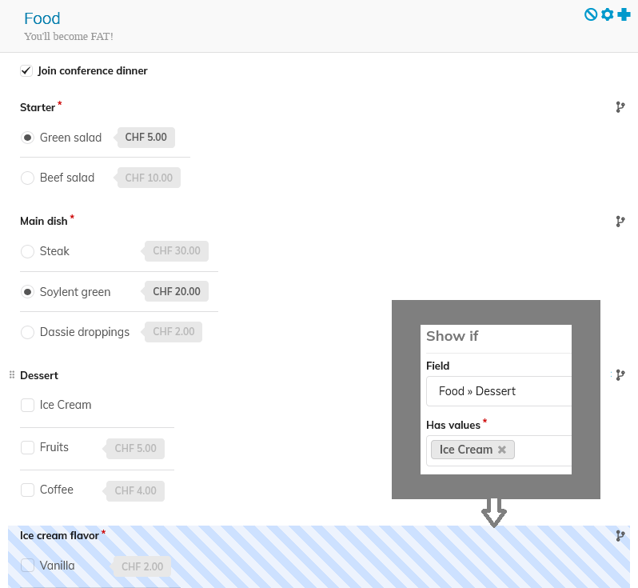

<!-- _backgroundColor: #161630 -->

---

<!-- _footer: '
  Adrian Mönnich • Indico Community Meeting • Sep 2026 
  Picture: ["Pillars of Creation" by NASA](https://www.flickr.com/photos/nasawebbtelescope/53876176351/) (CC BY)
' -->

# What's new in the Indicoverse
## 2026th edition

---

## Old, new management

- Thanks **Pedro Ferreira** (Section Leader + Indico Product Manager)
  - now works with C++, Rust and CERN's Tape Libraries
- Welcome back **Thomas Baron** as Section Leader
  - first Indico Project Manager (and one of the first devs) in 2004
  - used to be our Section Leader before Pedro

---

## Thanks for all your contributions

Many old faces, but also some new.
Couldn't have worked with - and still work with - better people! 💙

<!-- _footer: Only listing people who've been with (or left) us since the last Workshop in 2025 -->

---

## Releases

- No big release yet [still on v3.**3**]
  - we'll jump to v3.4 when the new timetable is done
- **7** "smaller" releases [v3.3.**13**]
  - Features
  - Bugfixes
  - Security improvements
  - Accessibility improvements (👨‍💻 UNOG)

<!-- _footer: Yes, our version numbering is still pretty chaotic. We're basically doing rolling releases. -->

---

### v3.3.7 **(July 2025)**

- 🏆 Conditional registration form fields (💰 Max Planck)
- Improved built-in logging (event, user, global)
- Improved favorite user management (from search results)
- Linking event reminders to registration forms + tags
- Setting to restrict public user search

---

### v3.3.8 **(September 2025)**

- Material package restrictions (thanks, crawlers...)
- Custom (free-text) event reminders
- Custom checkin QR code support

---

### v3.3.9 **(December 2025)**

- 🇫🇮 Finnish translation
- Registration pictures in check-in app

---

### v3.3.10 **(February 2026)**

- 🔒 Content-Security-Policy support
- Predefined affiliations management UI
- File types in Paper Peer Reviewing
- Cloning regforms within an event

---

### v3.3.12 **(March 2026)**

- Fine-grained registration management permissions
- Containerized LaTeX rendering
- Bulk selection in data tables (shift-click on checkboxes)

---

### v3.3.13 **(August 2026)**

- 🇰🇷 Korean translation
- Favorite contributions + "My timetable"
- Cloning survey sections
- Affiliation regform field type (supports predefined affiliations)
- Log registrations done on behalf of another user
- Redesign public participant list w/ pagination
- Support anonymous (number only) accompanying persons

---

### There's much more

This was just a tiny selection of features!
Consult the changelog for a full list:

https://docs.getindico.io/en/stable/changelog/

Also for the upcoming release:

https://docs.getindico.io/en/latest/changelog/

---

## Under the hood

- Hardened **GitHub Actions** CI
  - keeping the supply chain safe
- Minimum dependency ages
  - Shai-Hulud & the likes - so far, we got lucky
  - Giving new packages a few days to "rot"
- **Biome** for better+faster JS formatting
  - Prettier was outdated and made very questionable style choices
  - Biome needed some patching, too, but easier + more fun (Rust)

---

<!-- _backgroundColor: #021e2b -->

---

## Status of the community

- Over ~~210~~ ~~320~~ **344** active instances world-wide registered
  - More exist (not public or simply not registered)
- Forum is very active - including users helping each other 🤝
  - Thanks especially to those among them who are here today!

---

<!-- _backgroundColor: #000000 -->

---

---

### Indico versions

Some are still on v2
Obsolete Indico version
Obsolete Python version (2.7)
Obsolete OS versions
=> No security updates!!

---

### Postgres versions

Quite a few end-of-life
PG 9.6 == Indico <3.2

---

## External contributors

- **UNOG** 👨‍💻 contributed features + a11y via Pull Requests
- **Max Planck** 💰👨‍💻 funded freelance contributions via PRs
- **WIPO** 👨‍💻 funded features via PRs (from Unconventional)
- 🙏 *Individual (unpaid) contributors sending PRs* 👨‍💻

---

## Security

- A few security fixes, one major fix
- Part of normal releases
- **You need to keep Indico up-to-date!**
  - for major fixes we notify via community hub contact emails

---

### v3.3.{7..9}

- [3.3.7] 🕵️‍♂️ Prevent dumping basic users details in bulk
  - also added setting to restrict search
- [3.3.8] 🕵️‍♂️ Legacy API returning details for other users
- [3.3.8] 👨‍💻 XSS in contribution math rendering
- [3.3.9] 👨‍💻 Open redirect
- [3.3.9] 👨‍💻 XSS with HTML materials stored on S3

---

### v3.3.{10..11}

- [3.3.10] 🖥️ SSRF returning data from local IPs
- [3.3.10] 👨‍💻 Open redirect
- [3.3.10] 👨‍💻 XSS in material upload
  - we also added a strict CSP here
- [3.3.11] ⛔ Missing access check in event series management
  - potential (series) data manipulation
  - but nothing "fun" one could do with it

---

### v3.3.12, the interesting one

- [3.3.12] 💥 Insufficient LaTeX sanitization
  - LaTeX command injection --> read local files
  - Chained with a TeXLive 0-day --> write local files
  - Writing arbitrary local files --> RCE 🤯
  - LaTeX sucks. Period. <small>(unless you only render your own LaTeX locally)</small>
  - Now containerized by default <small>(on new setups)</small>
  - But maybe just don't use it if you don't need it <small>(off by default)</small>

---

### v3.3.13, back to boring ones

- [3.3.13] 👨‍💻 XSS when resolving conflicts in minutes
- [3.3.13] 👨‍💻 XSS with custom links in some places
- [3.3.13] ⛔ Missing access check legacy session export API
- [3.3.13] 🖥️ Incomplete SSRF check

---

## Plugins

- **Stripe Payment** 🆕
  - Released shortly after the last workshop
- **S3 storage**
  - Strict CSP for file downloads (XSS protection)
- **VC Zoom**
  - Language Interpretation setup
  - Personalized Zoom links for participants
  - Auto-checkin via personalized links

---

<!-- _backgroundColor: #021e2b -->

