<!-- _backgroundColor: #449288 -->

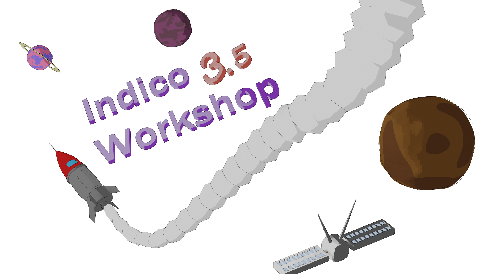

---

<!-- _footer: Adrian Mönnich • Indico Workshop 3.5 • March 2023 -->

# What's new in the Indicoverse (Season 2... or 3?)

---

## Old, new management

- Thanks **Thomas Baron** for leading the Section until 2022
- Thanks **Tim Smith** for leading the Group until 2022
- Welcome **German Cancio** as the new **Group Leader**
- Congrats **Pedro** (former Indico PM) on becoming **Section Leader**
- **Adrian** (still Lead Dev) officially taking over as **Project Manager**

---

## Thanks for all your contributions

Couldn't have worked with - and still work with - better people! 💙

<!-- _footer: Only listing people who've been with us since the last Workshop in 2017 -->

---

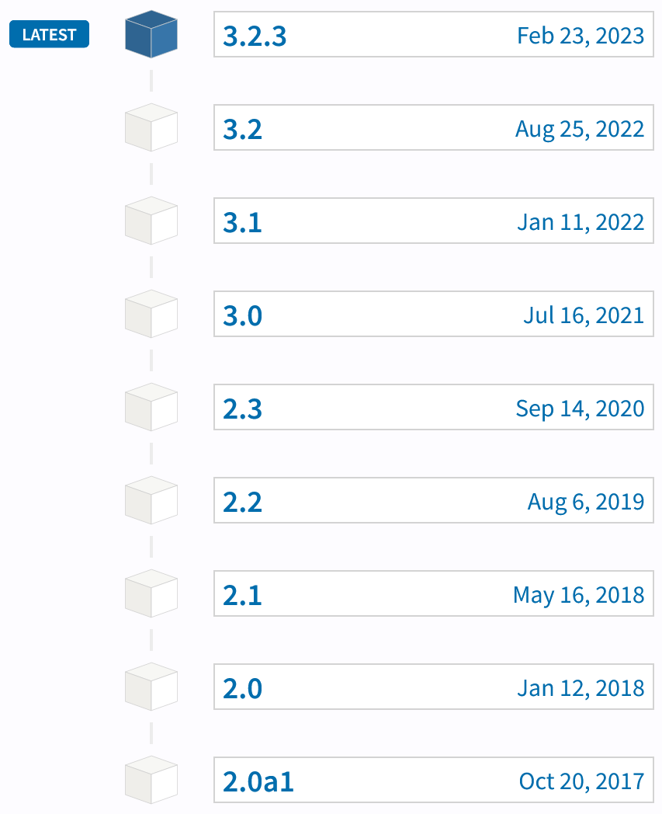

## Let's get technical

- **1** major version bump [**3**.0]
  - Python 3<small>.9</small> ~ Indico 3.0
  - "Reinstall on a new system"
- **7** big releases [3.**2**]
  - Major features
  - JS/Python dependency updates
  - DB structure changes
  - Webserver config changes (rarely)
- **Many more** smaller releases [3.2.**3**]
  - Features
  - Bugfixes

---

### v2.0a1 **(Oct 2017)**

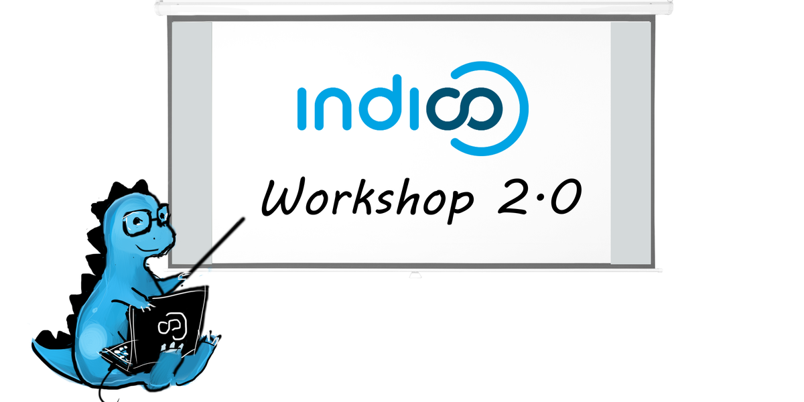

Released live during the previous workshop
Over **5 years of development** since that day

"Short" summary of significant features and milestones...

---

### v2.0 **(Jan 2018)**

- ~~ZODB~~ is gone - PostgreSQL 🐘 is there to stay!
- "Legacy Indico" era coming to an end
  - Except when helping people migrate their ancient v0.x Indico instances that haven't been updated in years...
- Brand-new docs
  - End-user docs (https://learn.getindico.io)
  - Technical & setup docs (https://docs.getindico.io)
- Community forum (https://talk.getindico.io)
- Features? Too many things to list here ;)

---

### v2.1 **(May 2018)**

- More centralized event permission config
- Custom event roles (basically groups within an event)
- More flexible reviewing questions
- Importing some data from CSV files

---

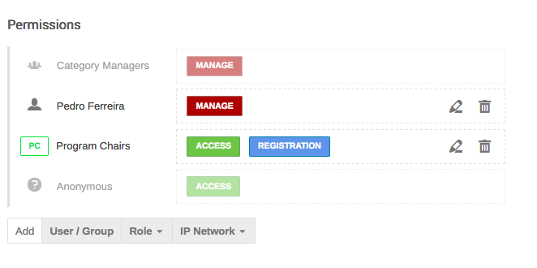
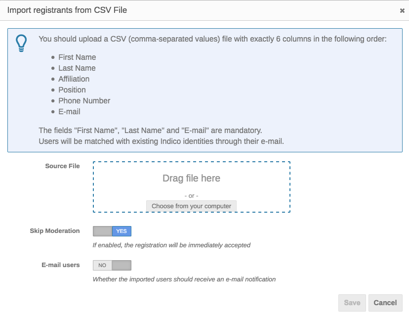

---

### v2.2 **(Aug 2019)**

- Introducing React & SemanticUI
- Switch to **Webpack** for asset bundling (JS/CSS)
  - No more (slow) on-the-fly compilation in prod
- Brand-new **Room Booking** module (using React)

---

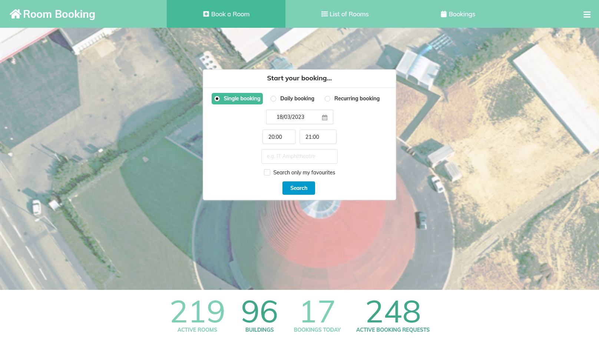

---

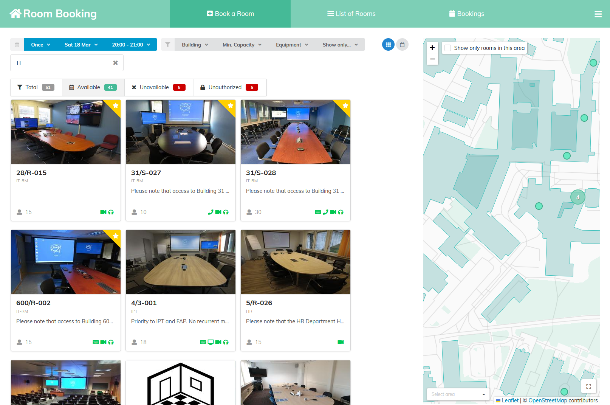

---

### v2.3 - "Made at Home" **(Sep 2020)**

- Significant **external contributions**
  - UNOG 👨‍💻 & IEEE 💰
- React & Semantic UI usable everywhere
- **Paper Editing** module (using React)
- Registration module improvements (UNOG)
- Category-scoped roles (IEEE)
- **Data import** from existing events (UNOG)
- Contextual event log filtering (UNOG)

---

### v3.0 🐍 **(Jul 2021)**

- **Python 3**
- New **search** module + backend
- Mixed categories (events + subcats)
- User avatars actually shown in various places
- Clean **API auth** (Personal Tokens like on GitHub)
- Password security checks (**Have I Been Pwned**)
- System notices (for outdated versions)
- Alternative meeting themes w/o contribution times
- SAML support without Shibboleth/Apache
- Event labels (e.g. "cancelled" or "postponed" - guess why!)
- Did I mention Python 3? 🐍

---

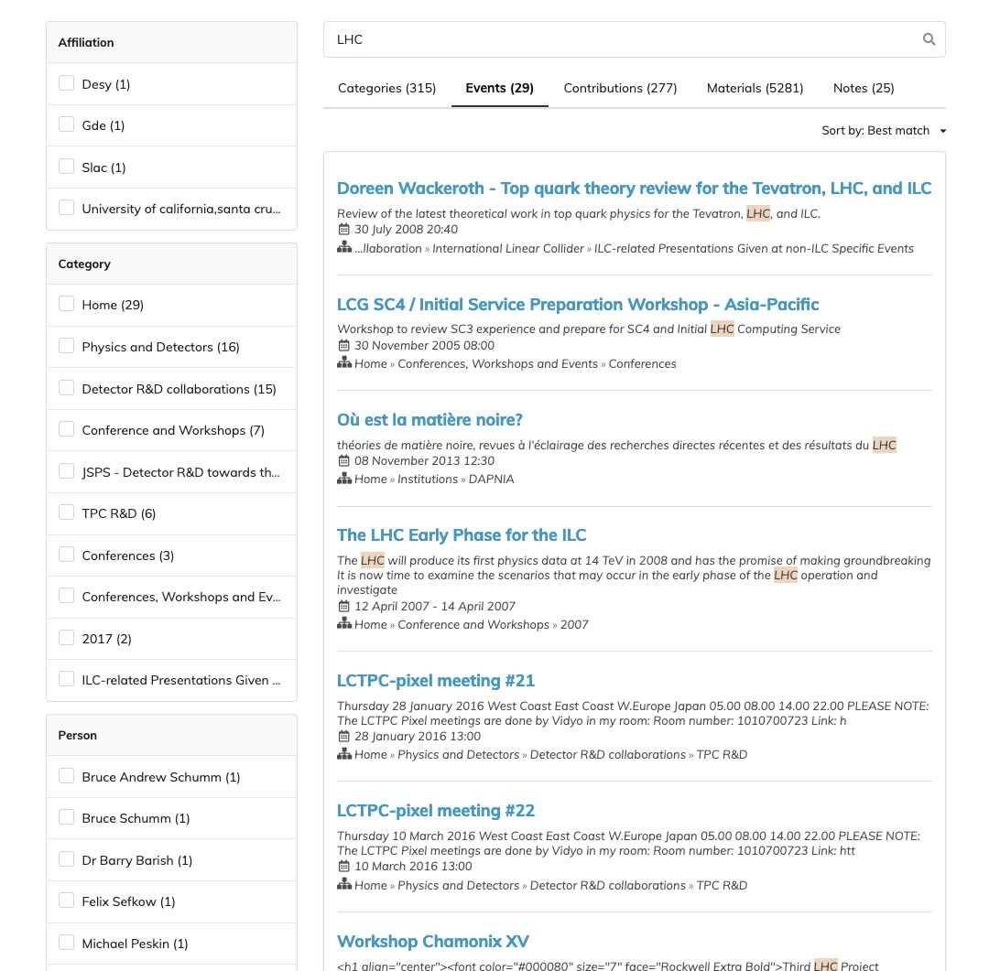

---

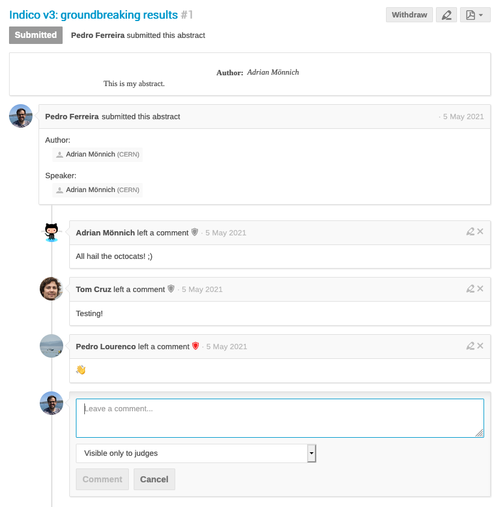

---

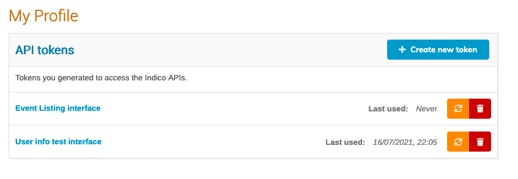

---

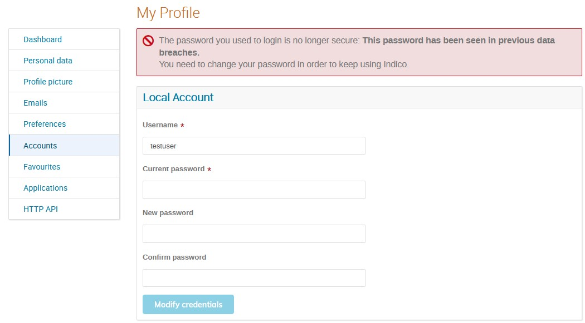

---

### v3.1 **(Jan 2022)**

- Moderated categories
- Unlisted events
- Category action log
- Registration tags/labels

---

### v3.2 **(Aug 2022)**
- Significant **external contributions**
  - UNOG 👨‍💻 & Max Planck 💰👨‍💻
- **Privacy features** <small>Part 1</small> <small>*(...and we all love GDPR, right?)*</small>
  - Privacy policy URL/text & Data Controller details
  - Retention periods for registrations (or specific fields)
  - Consent option for participant list
- **New registration form UI** (React)
- Favorite events (Max Planck)
- **Markdown** for minutes (Max Planck)
- Event series management (Max Planck)
- **Pasting images** into editors
- Image upload in badge designer (UNOG)
- CAPTCHA protection

---

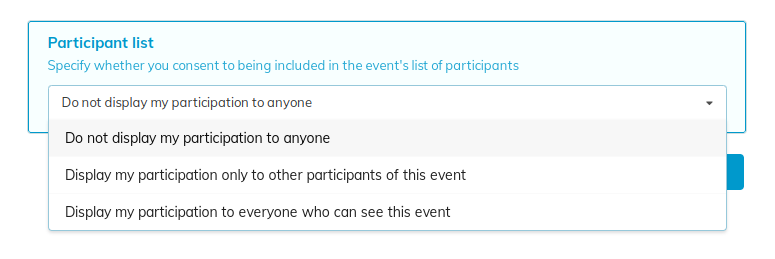

---

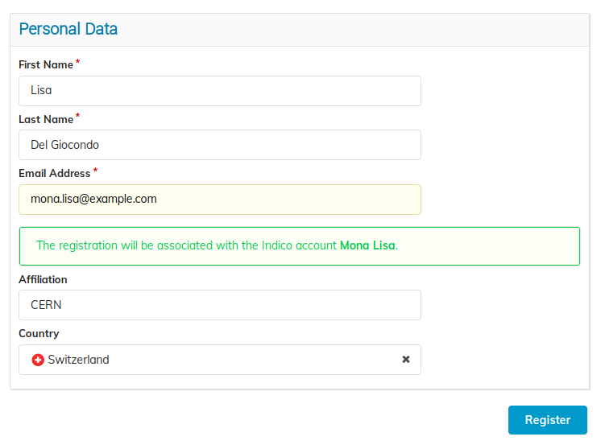

---

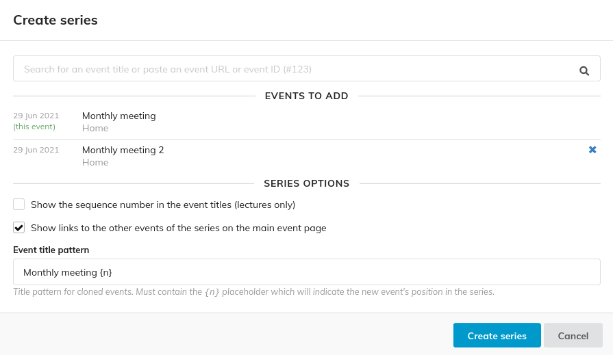

---

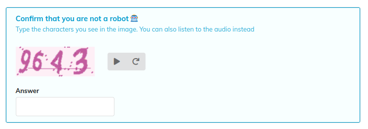

---

<!-- _backgroundColor: #021e2b -->

---

## Status of the community

- Over 210 active instances world-wide registered
  - Many more exist (not public or simply not registered)
- Forum is very active - including users helping each other 🤝
  - Thanks especially to those among them who are here today!

---

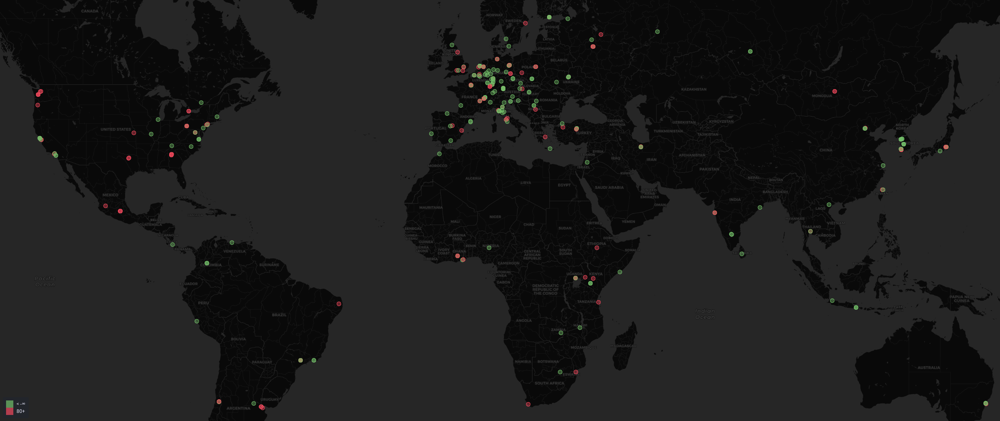

---

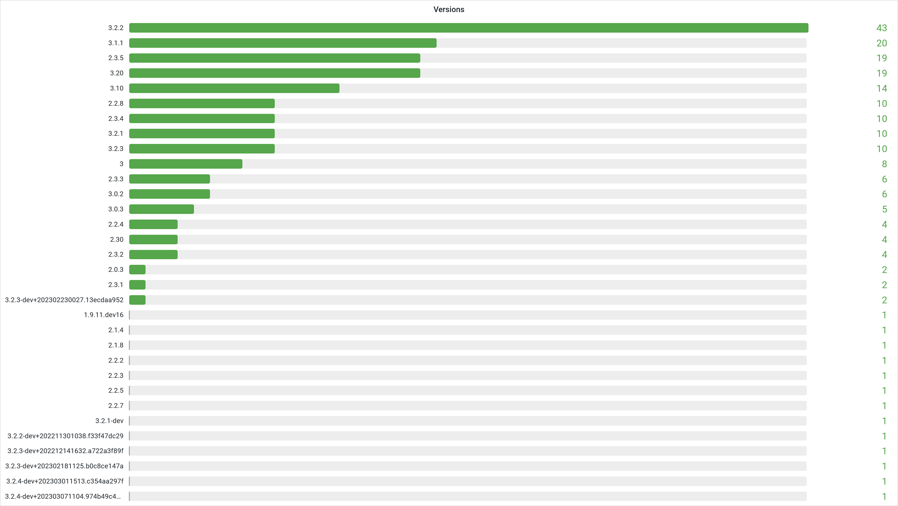

---

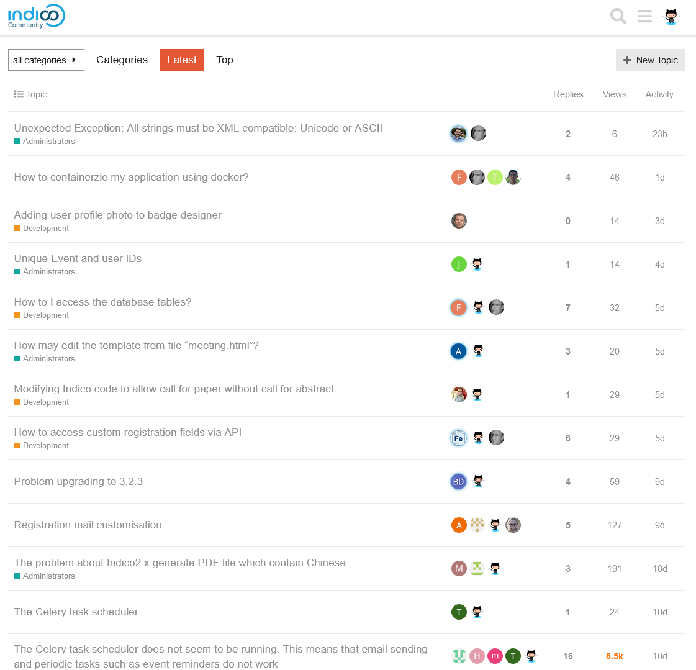

---

## External contributors

- **IEEE** 💰 funded an intern at CERN for development
- **UNOG** 👨‍💻 contributed features via Pull Requests
- **Max Planck** 💰👨‍💻 funded freelance contributions via PRs
- **Canonical** 👨‍💻 contributed features via PRs
- 🙏 *Individual (unpaid) contributors sending PRs* 👨‍💻

---

## Security

Most security fixes just update external dependencies: usually minor and/or not exploitable, but better safe than sorry!

One Indico vulnerability (**in indico<=2.2**) that was *truly* dangerous 💥

- As expected: Caused by **legacy code**... 🧟‍♂️
- Required an authenticated user with some privileges & LaTeX enabled
- But being able to **read arbitrary local files** was OBVIOUSLY NOT OK!
- Fixed in current version + backported to previous version
- **Notified users** via Community Hub before public announcement
- Yes, people *still* on Indico v2.0 (or older 🤦‍♂️) are still vulnerable... 
  - THIS IS WHY YOU MUST UPDATE YOUR SYSTEMS 😡

---

### v2.x

- [2.3.5] 👨‍💻 Cross Site Scripting (XSS) (only with manager access)
- [2.3.4] 🧑 Open redirects after logging in
- [2.3.4] 🧑 Tampering with URL in password reset emails
- [2.2.3] 💥 LaTeX local file inclusion
- [2.2.3] 🧹 Sanitize data in CSV files because MS Excel is insecure 🤦‍♂️
- [2.1.3] 👀 Fix access check for timetable entry metadata
- [2.0.3] 👀 Fix access check for contribution list metadata

---

### v3.x

- [3.2.3] 👨‍💻 Cross Site Scripting (XSS)
  - Required attacker to be an admin... "Hack your own Indico"?
- [3.0.3] 👨‍💻 CSRF risk during local-account login

---

## Plugins

- **Citadel Search**
  - Search integration via the "Citadel" software and ElasticSearch
  - More powerful (fulltext search in materials & aggregations) than the built-in search
- **S3 Storage:** Store materials etc. on an S3-compatible backend
- **ownCloud:** Upload files from your organization's ownCloud
- **Zoom VC:** Create/manage Zoom videoconferences via Indico
- **Cloud CAPTCHAs:** Integrate reCaptcha or hCaptcha
- **SIXPay Payment:** Pay for events using SIXPay-Saferpay
  - Used to be a community plugin but was semi-abandoned
  - We ported it to Indico v3 and took over maintenance

---

<!-- _backgroundColor: #021e2b -->

