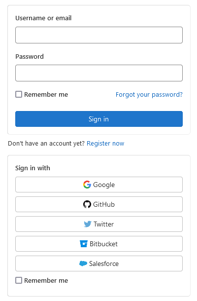

<!-- _paginate: false -->

<style scoped>
    h1, h2, h3, h4 {
        color: #fff;
    }
    h2 {
        margin-bottom: 0;
    }
    h3 {
        margin-top: 0;
    }
    h2, h3, h4 {
        text-align: right;
    }
    footer {
      text-shadow: none;
      color: #fff;
    }
    img {
      margin-left: -2em;
    }
</style>


### A pluggable auth framework for Flask

---

## About me

**Adrian Mönnich** (@ThiefMaster)

👨‍💻 Project Manager & Lead Developer of the [Indico project](https://getindico.io) at CERN
🛠️ One of the [Pallets](https://palletsprojects.com/) maintainers
🐍 **Python** enthusiast since over 10 years

---

## Why?



Letting people log in through different means

Local accounts (username/password)
LDAP, SSO, Social Media, ...

---

### Local is easy...

It's just a simple form.

<span data-marpit-fragment>Yes, really. No complexity there. 🎉</span>

---

### LDAP is "fun"...

Also just a simple form...

<div data-marpit-fragment>

Except that you also need to configure this:

```python
{
    'uri': 'ldaps://ldap.example.com:636',
    'bind_dn': 'uid=admin,DC=example,DC=com',
    'bind_password': 'secret',
    'uid': 'uid',
    'user_base': 'OU=Users,DC=example,DC=com',
    'user_filter': '(objectCategory=person)',
}
```
</div>

<span data-marpit-fragment>Even worse with groups - Active Directory vs OpenLDAP</span>

---

### What about Social Media?

<span data-marpit-fragment>~~OpenID~~ (nobody is using *that* anymore 🧟‍♂️)</span>
<span data-marpit-fragment>OAuth 1 (Twitter still uses it)</span>
<span data-marpit-fragment>OAuth 2 (Pretty much everyone else)</span>
<span data-marpit-fragment>OpenID Connect (unrelated to OpenID 🤯 - almost like OAuth 2)</span>

---

### Enterprise SSO systems?

<span data-marpit-fragment>OpenID Connect (easy 🎉)</span>
<span data-marpit-fragment>SAML (XML hell 👿)</span>
<span data-marpit-fragment>CAS (seems less popular, never used it 🤷‍♂️)</span>
<span data-marpit-fragment>LDAP (not really SSO, but very enterprise-y)</span>
<span data-marpit-fragment>*Some custom/proprietary system* 🔐</span>

---

## How does Flask-Multipass solve this?

```python
multipass = Multipass(app)

# You just need the callback on login success
@multipass.identity_handler
def identity_handler(identity_info):
    session['user_identifier'] = identity_info.identifier
    # Note: Usually you would query a user and then call
    # login_user() from Flask-Login (or do something else)
```

Login page and forms are rendered automatically, you just need to provide the templates.

---

### Configuring providers

Specifying how to log in...

```python
MULTIPASS_AUTH_PROVIDERS = {
    'github': {
        'type': 'authlib',
        'title': 'GitHub',
        'authlib_args': {
          'client_id': 'deadbeefdeadbeef1337',
          'client_secret': '<secret>',
          'authorize_url': 'https://github.com/login/oauth/authorize',
          'access_token_url': 'https://github.com/login/oauth/access_token',
          'api_base_url': 'https://api.github.com',
          'userinfo_endpoint': '/user'
        }
    }
}
```

---

### Configuring providers

...and how to retrieve data about the user

```python
MULTIPASS_IDENTITY_PROVIDERS = {
    'github': {
        'type': 'authlib',
        'title': 'GitHub',
        'identifier_field': 'id'
    }
}
```

Some provider types require more config of course, e.g. LDAP or SAML

---

### No code needed

Enabling new providers is **just a config change** 🔧
Ideal for applications that users **deploy without modifications**

---

## Live demo

---

## Custom provider types

Providers are registered using **setuptools entry points**

```ini
[options.entry_points]
flask_multipass.auth_providers =
  cern = flask_multipass_cern:CERNAuthProvider
flask_multipass.identity_providers =
  cern = flask_multipass_cern:CERNIdentityProvider
```

Can be implemented from scratch, or extend existing provider
Example: OIDC/OAuth2 to log in, then an API call to get details

---

## Other features

Base classes for local auth when using SQLAlchemy
Searchable user directories - especially in enterprise contexts
Group integration - searching, checking membership, listing members

---

### SQLAlchemy integration

```python
class LocalAuthProvider(SQLAlchemyAuthProviderBase):
    identity_model = Identity
    provider_column = Identity.provider
    identifier_column = Identity.identifier

    def check_password(self, identity, password):
        return identity.password == password

class LocalIdentityProvider(SQLAlchemyIdentityProviderBase):
    user_model = User
    identity_user_relationship = Identity.user

multipass.register_provider(LocalAuthProvider, 'local')
multipass.register_provider(LocalIdentityProvider, 'local')
```

---

### Search & Groups

```python
# searching returns an iterator
users = list(multipass.search_identities(email='@example.com', exact=False))
groups = list(multipass.search_groups(name='admins', exact=True))
```

---

## More information

GitHub: https://github.com/indico/flask-multipass
Docs: https://flask-multipass.rtfd.io
IRC: #indico on Libera.Chat
