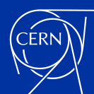
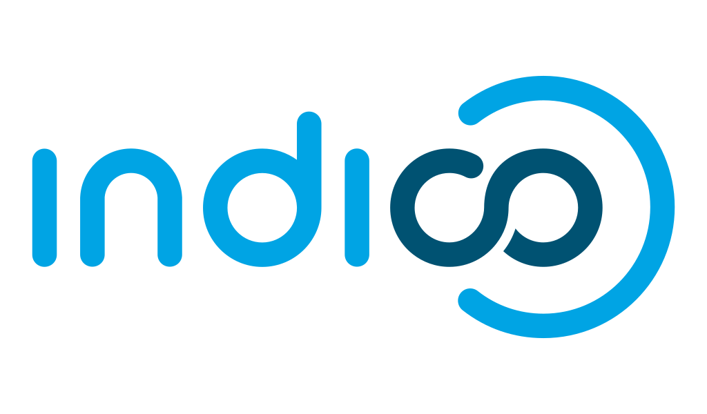
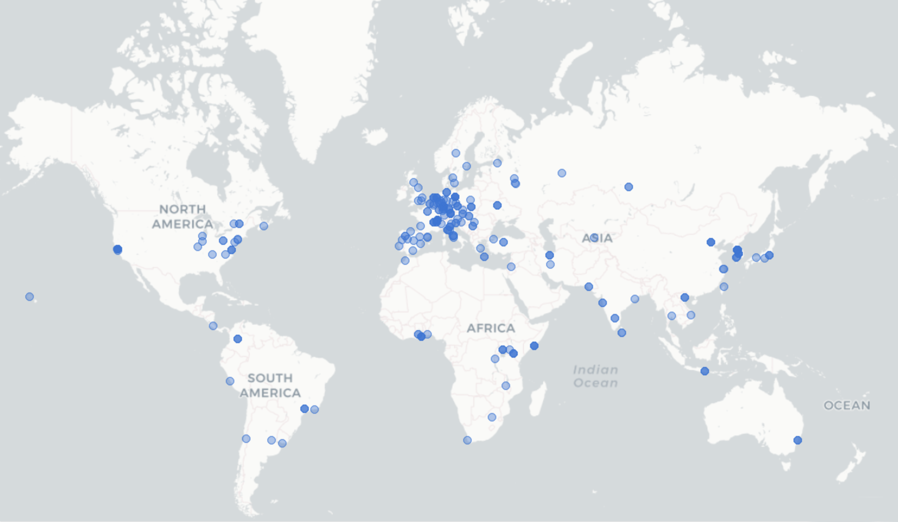
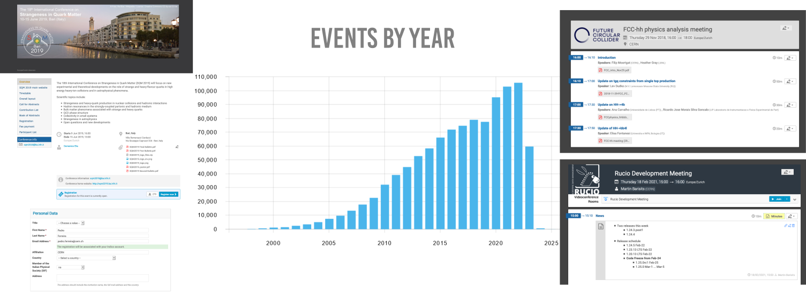
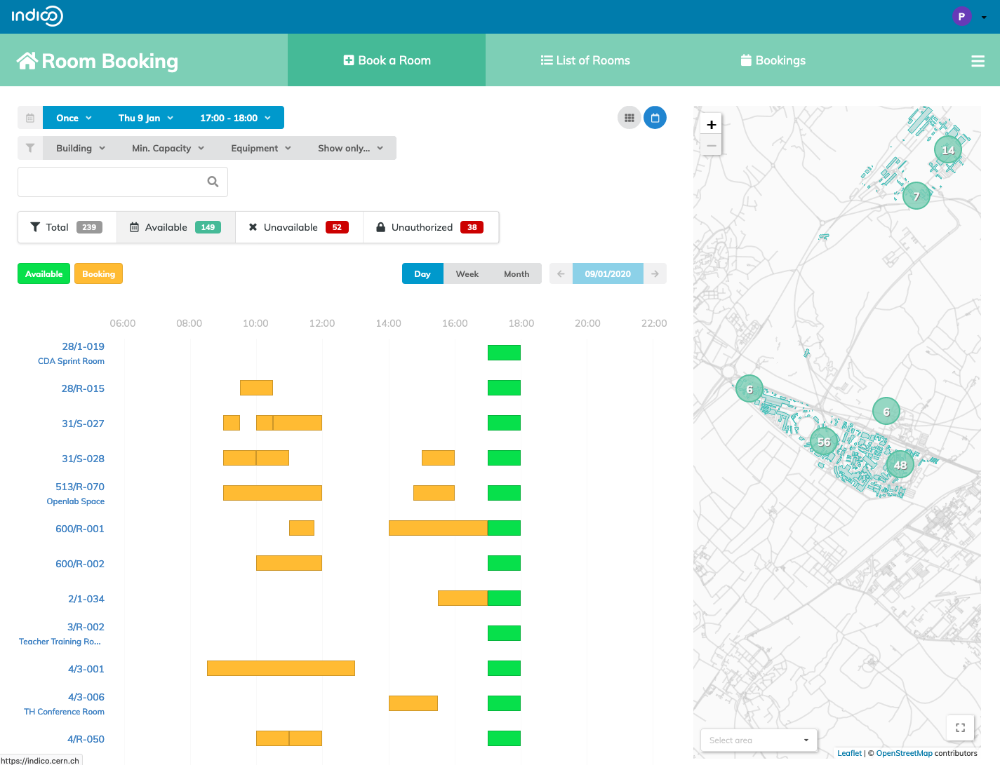
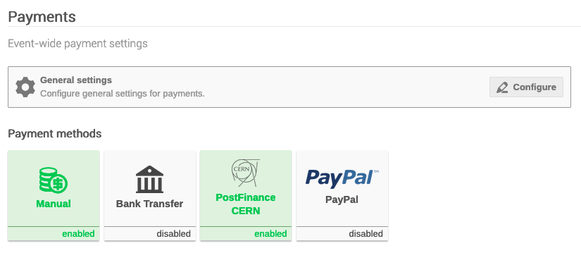
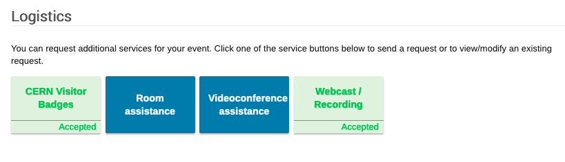
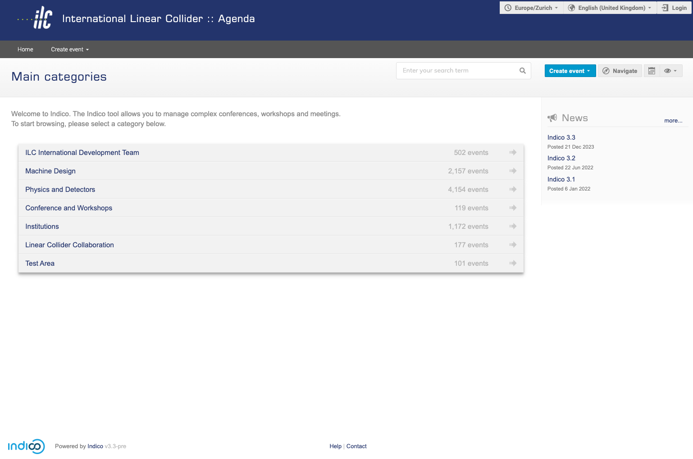
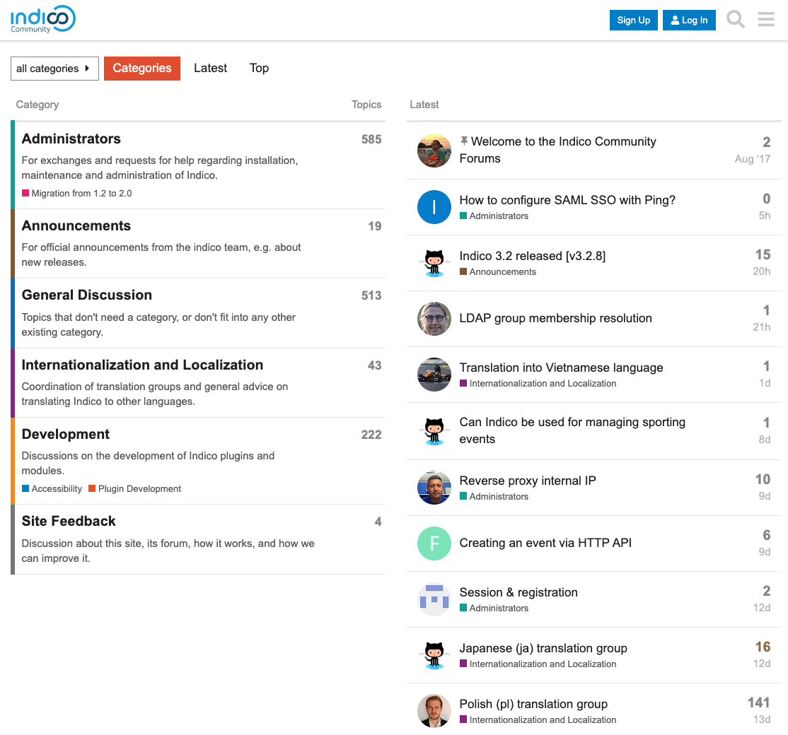
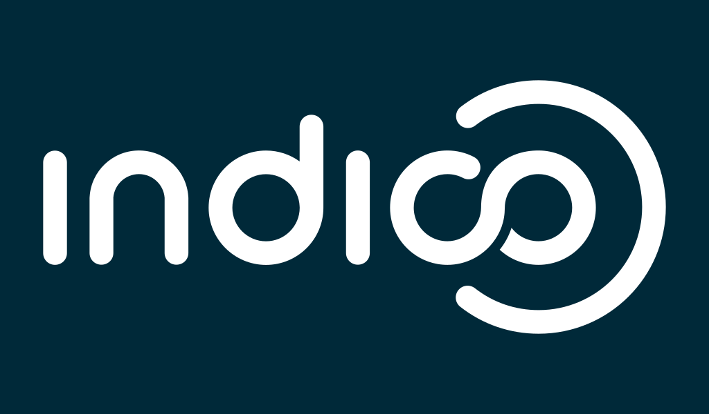

<!-- _footer: '' -->

<!-- _backgroundColor: #0033A0 -->

---

*an event management system*
*from* **CERN** *to the* 🌍

### Adrian Mönnich (CERN)

<!-- _footer: CC BY-NC-SA 4.0 • Indico and CERN logos: © Copyright CERN • Based on presentation by Pedro Ferreira -->

---

### 

- **Event Management** System
- **Collaborative effort** - Open Source (MIT license)
- Core Developed at **CERN**
- ~ **75 developers** over the years
- With contributions from the **United Nations**, **Max-Planck Institute for Physics** and many others!

---

*The most popular event management system you never heard about*

 - **300+ servers**
 - **> 350K users**
 - Initial growth in research, but growing beyond it
   - [indico.un.org](https://indico.un.org)
   - [events.canonical.org](https://events.canonical.com/)
   - [events.gnome.org](https://events.gnome.org)
   - [lpc.events](https://lpc.events)

---

### History

 - **1999** - **CDS Agenda**
 - **2002** - **EU Project**
 - **2004** - Indico in **Production**
 - **2007** - **Room Booking**
 - **2008** - **Interface overhaul**
 - **2013** - First **Workshop**
 - **2015** - The **UN** starts using it
 - **2017** - Indico 2.0 (**rewrite, SQL**)
 - **2021** - Indico 3.0 (**Python 3** 🐍)
 - **2023** - **1 Million Events** surpassed at CERN 🎉
 - **2024** - **20 years!** 🎂

---

### Open Source

- Free **redistribution**
- Distributed **peer review**
- **Transparency**
- **Community** with common goals

---

### Open Source

- Powering most of the internet
  - MongoDB, ElasticSearch, MySQL, PostgreSQL, Apache, **Linux**...
- **CERN** was a pioneer
  - World Wide Web
  - Indico, Invenio, ROOT...

---

<!-- _footer: © Copyright CERN --->

---

### CERN

- **~10.000** people on campus
- **~225** meeting rooms
- **>100.000** events/year
  - up from 80k pre-COVID
  - **1.130.000** events total
- (Distributed) Meetings
- Conferences, workshops
- Lecture series

---

### Adoption at CERN

---

---

---

### Philosophy

 - "Agnostic" **core** ("CERN-free")
 - Extension through **plugins** 🧩
 - **Themes** 🎨 (customization)

---

### Under the Hood

 - Python 3 🐍
 - PostgreSQL 🐘
 - Flask
 - SQLAlchemy
 - Celery
 - React
 - Semantic UI React
 - *and many more!*

---

### Extensions

 - Video conferencing 📹
 - Payment Systems 💰
 - Automatic conversion to PDF 🖨
 - Search 🔎
 - Storage 💾
 - OwnCloud integration 📁 (material upload)
 - URL Shortening 👉
 - Internal Workflows (e.g. recording, visitors)

---

### Zoom

---

https://github.com/indico/indico-plugins/tree/master/vc_zoom

---

### Electronic Payment

---

### Workflows

---

### Access Registration

---

### Webcast / Recording

---

### ownCloud integration

---

### Hotdesks

---

### Themes / Customization

---

### Themes / Customization

---

### Themes / Customization

---

### Check-in App (PWA)

---

### To summarize
 - Extensible event management system
 - Open Source
 - Mature and actively maintained
 - Ecosystem of plugins
    - official + 3rd party
 - Thriving community
 - **Everyone is welcome**!

---

### Governance Model 🆕

<table>
    <tr>
        <th></th>
        <th>Contribution</th>
        <th>Influence</th>
    </tr>
    <tr style="background-color: #f7f7f7;">
        <td>Indico Community</td>
        <td>Voluntary</td>
        <td>Ideas and suggestions</td>
    </tr>
    <tr style="background-color: #e8f0f9;">
        <td>Participating Organizations</td>
        <td>Significant (code, translations, outreach, etc.)</td>
        <td>Attend community meetings, a say in community resource allocation</td>
    </tr>
    <tr style="background-color: #e1dbeb">
        <td>Consultative Board</td>
        <td>Particularly relevant</td>
        <td>Approve roadmap and steer general Project development</td>
    </tr>
</table>

---

### Get involved!

- Do you run an Indico instance and want to support the project?
- Maybe **your** organization would like to become a **Participating Organization**?
- Reach out to us if you're interested!
  ✉ indico-team@cern.ch
- Detailed governance policy:
  https://github.com/indico/governance

---

# Glimpse into the future

<!-- _footer: '
  Picture: ["Crystal Ball" by Jeffrey](https://www.flickr.com/photos/jb912/25501052393/) (CC BY-ND)
' -->

---

## v3.3 - coming very soon

- **Privacy features**
  - Yep, we still *love* GDPR
  - User-accessible dump of everything they are linked to
  - Accept privacy notice during registration / signup
  - Admin tool to anonymize an account
- Receipt/certificate generation
  - Fully customizable templates for PDF generation
- And many more smaller improvements

---

## v3.4 - later this year

- **Rewrite of the conference timetable** & timetable management in React
  - Rare cases will take the most time... e.g. heavily parallel conferences
- Remove most (all?) ultra-legacy JS (from before jQuery)
  - Opens the door for improving our build pipeline

---

### Find us online

 [@getindico@fosstodon.org](https://fosstodon.org/@getindico)
 [@getindico](https://twitter.com/getindico)
 [#indico:matrix.org](https://app.element.io/#/room/#indico:matrix.org)
#️⃣ #indico on libera.chat IRC

🌐 [getindico.io](https://getindico.io)
🌐 [github.com/indico/indico](https://github.com/indico/indico)
🌐 [github.com/indico/governance](https://github.com/indico/governance)
✉ indico-team@cern.ch

---

<!-- _footer: '' -->
<!-- _paginate: false -->

<!-- _backgroundColor: #002939 -->

